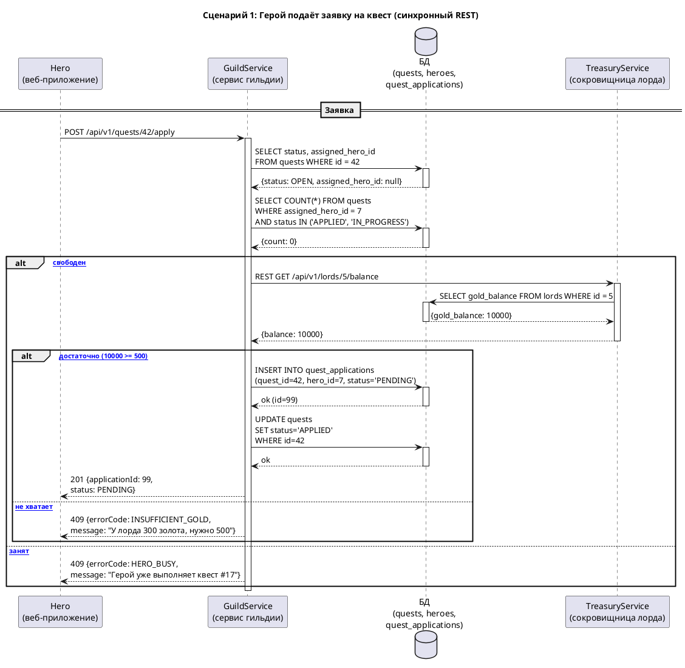
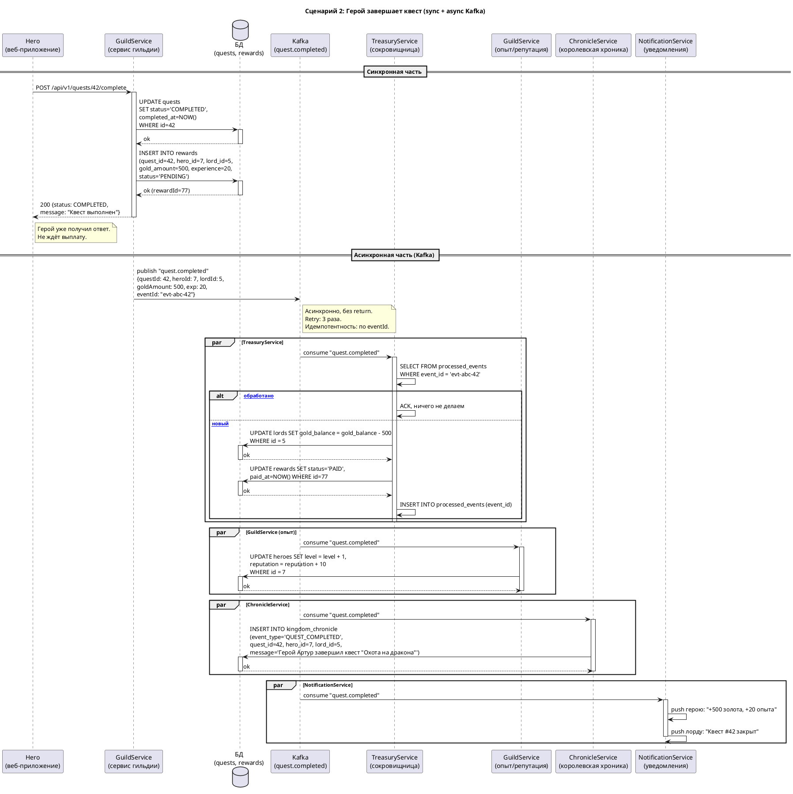

# Эталонное решение. Гильдия героев

---

## 1. Практические приёмы проектирования

### Как определить сущности

**Приём «имена существительные»:**
Прочитай контекст. Выпиши все имена существительные, которые обозначают «вещь» или «понятие», о котором храним данные.

Из контекста:
- «герои» → `heroes`
- «лорды / заказчики» → `lords`
- «квесты» → `quests`
- «заявки» → `quest_applications`
- «награды / выплаты» → `rewards`
- «навыки» → `hero_skills`
- «хроника / летопись» → `kingdom_chronicle`

**Приём «кто-что-когда-где-почему»:**
- Кто? → `heroes`, `lords`
- Что? → `quests`
- Как заявлял? → `quest_applications`
- Что получил? → `rewards`
- Какие характеристики? → `hero_skills`
- Где записано? → `kingdom_chronicle`

**Приём «1 сущность = 1 таблица, 1 строка = 1 экземпляр»:**
- Герой Артур = 1 строка в `heroes`
- Квест «Охота на дракона» = 1 строка в `quests`
- Заявка Артура на квест = 1 строка в `quest_applications`

**Красный флаг:** если в «таблицу» хочется добавить поле `hero_name` (повтор из `heroes`) — это денормализация, на этапе проектирования не делаем. Храним `hero_id`, имя берём JOIN-ом.

---

### Как определить REST-эндпоинты

**Приём «CRUD по сущности»:**
Для каждой «основной» сущности (не таблицы-связки) — 4 базовых операции:

| Сущность | GET (список) | GET (один) | POST | PATCH/PUT | DELETE |
|---|---|---|---|---|---|
| quests | `GET /quests` | `GET /quests/{id}` | `POST /quests` | `PATCH /quests/{id}` | `DELETE /quests/{id}` |
| heroes | `GET /heroes` | `GET /heroes/{id}` | `POST /heroes` | `PATCH /heroes/{id}` | — |
| lords | `GET /lords` | `GET /lords/{id}` | `POST /lords` | `PATCH /lords/{id}` | — |

**Приём «действия, которые не являются CRUD»:**
Если действие меняет состояние, но не создаёт/не удаляет сущность — sub-action:

```
POST /quests/{id}/apply          (герой подаёт заявку)
POST /quests/{id}/accept         (лорд принимает заявку)
POST /quests/{id}/reject         (лорд отклоняет)
POST /quests/{id}/start          (герой начинает квест)
POST /quests/{id}/complete       (герой завершает квест)
POST /quests/{id}/cancel         (лорд отменяет квест)
```

> **Почему `POST /quests/{id}/apply`, а не `POST /quest-applications`?**
> Оба варианта допустимы. Sub-action на квесте (`/quests/{id}/apply`) — контекст в URL понятен: «к квесту 42 — заявка», не нужно передавать `quest_id` в body. Чистый CRUD (`POST /quest-applications`) — единообразнее, но `quest_id` уходит в body. На собесе оба защитятся. Если в команде есть конвенция «все действия — на родительском ресурсе» — берём sub-action. Если «CRUD по сущности» — берём `/quest-applications`.

**Приём «чтение по связи»:**
```
GET /heroes/{id}/quests           (квесты героя)
GET /lords/{id}/quests            (квесты лорда)
GET /quests/{id}/applications     (заявки на квест)
```

**Итого REST API (12 эндпоинтов):**

| Метод | Путь | Что делает |
|---|---|---|
| GET | `/api/v1/quests` | Список квестов (фильтры: status, lord_id, skill) |
| GET | `/api/v1/quests/{id}` | Один квест |
| POST | `/api/v1/quests` | Лорд публикует квест |
| PATCH | `/api/v1/quests/{id}` | Лорд меняет квест (награда, срок) |
| DELETE | `/api/v1/quests/{id}` | Лорд отменяет квест |
| POST | `/api/v1/quests/{id}/apply` | Герой подаёт заявку |
| POST | `/api/v1/quests/{id}/accept` | Лорд принимает заявку |
| POST | `/api/v1/quests/{id}/reject` | Лорд отклоняет заявку |
| POST | `/api/v1/quests/{id}/start` | Герой начинает квест |
| POST | `/api/v1/quests/{id}/complete` | Герой завершает квест |
| GET | `/api/v1/heroes/{id}/quests` | Квесты героя |
| GET | `/api/v1/lords/{id}/quests` | Квесты лорда |

---

### Как выбрать индексы

**Приём «найди частые WHERE»:**
Прочитай все запросы (из сценариев и REST). Выпиши, какие колонки попадают в `WHERE`.

**Приём «равенство → диапазон»:**
В составном индексе: сначала колонки с `=` (точное значение), потом с `>=`, `<`, `BETWEEN` (диапазон).
Если **оба** условия — равенства (`lord_id = 7 AND status = 'OPEN'`) — порядок колонок не важен, оптимизатор использует обе.
Если есть **диапазон** (`lord_id = 7 AND created_at >= '2026-01-01'`) — порядок критичен: сначала равенство, потом диапазон.

**Приём «selectivity»:**
Индекс на колонку с мало уникальных значений (status: 4 значения) сам по себе слабый — отфильтрует ~25% строк. Лучше комбинировать с колонкой высокой selectivity: `(lord_id, status)` — 20 лордов (высокая selectivity) + 4 статуса (низкая). Сначала сузим по лорду (останется 5% строк), потом по статусу.

**Приём «покрывающий индекс»:**
Если `SELECT` берёт ровно те колонки, что в индексе — не нужно идти в таблицу (heap fetch). Быстрее.
Когда стоит: запрос **частый** (каждый экран/каждый тик) и SELECT-колонки **стабильны** (всегда одни и те же). Если SELECT-колонки меняются от запроса к запросу — покрывающий не поможет, будет слишком широкий.

---

### Как нормализовать (практически значимые приёмы)

Не «1НФ, 2НФ, 3НФ по учебнику». Три практических вопроса:

**Приём «повторяющийся набор»:**
Если в таблице повторяется набор полей (например, в `quests` поле `hero_name`, `hero_class`, `hero_level` — это данные из `heroes`) → вынести в отдельную таблицу, в `quests` оставить `hero_id`.

```
До:   quests: id, lord_id, title, hero_name, hero_class, hero_level
После: quests: id, lord_id, title, hero_id (FK → heroes)
       heroes: id, name, class, level
```

Признак: если обновил героя (повысил уровень) — надо обновить 50 строк в `quests`. Значит, не нормализовано.

**Приём «зависимость от части ключа»:**
Если таблица имеет составной ключ, а поле зависит только от **части** ключа → вынести.

Пример: `hero_skills (hero_id, skill_id, level, skill_name)`.
`skill_name` зависит только от `skill_id`, не от пары `(hero_id, skill_id)`. → Вынести в `skills (id, name)`.

```
До:   hero_skills: hero_id, skill_id, level, skill_name
После: hero_skills: hero_id, skill_id, level
       skills: id, name
```

**Приём «одно поле — несколько смыслов»:**
Если одно поле используется в разных контекстах с разной семантикой → разбить.

Пример: `quests.status = 'CANCELLED'` — но кто отменил? Лорд? Герой? Система? Если нужно знать — добавить `cancelled_by` (integer: 1=lord, 2=hero, 3=system) или отдельную таблицу `quest_events`.

**Когда НЕ нормализовать (денормализация осознанная):**
- Поле нужно **только для чтения** в отчёте и JOIN-ов много: `kingdom_chronicle` хранит `hero_name` текстом (не FK), потому что хроника — неизменяемая история. Если героя переименуют, хроника не меняется.
- Поле маленькое и дублирование дешёвое: `quests.lord_name` для списка квестов (чтобы не JOIN на каждый экран).

**Проверка:** после нормализации — «если я обновлю героя, сколько таблиц надо трогать?» Если 1 (`heroes`) — нормально. Если 3 — где-то денормализация.

---

### Как определить связи

**Приём «вопрос "сколько"»:**
Всегда спрашиваем: «У **одного** X сколько Y?» → если много, то `X 1:N Y`, FK в таблице Y.

- «У одного лорда сколько квестов?» → много → `lords 1:N quests`, FK `lord_id` в `quests`
- «У одного квеста сколько заявок?» → много → `quests 1:N quest_applications`, FK `quest_id` в `quest_applications`
- «У одного героя сколько заявок?» → много → `heroes 1:N quest_applications`, FK `hero_id` в `quest_applications`
- «У одного героя сколько навыков?» → много → `heroes 1:N hero_skills`, FK `hero_id` в `hero_skills`

**Приём «M:N = два вопроса с разных концов»:**
Если `heroes 1:N hero_skills` **и** `skills 1:N hero_skills` (т.е. один герой — много навыков, И один навык — много героев) → между `heroes` и `skills` это **M:N**. Таблица `hero_skills` — связка.

**Приём «M:N = 2 таблицы + 1 связка»:**
```
heroes  ──┐
          ├──> hero_skills (hero_id, skill_id, level)
skills  ──┘
```

---

## 2. Сущности и атрибуты (эталон)

### `heroes`

| Поле | Тип | Обязательное | Ограничения | Описание |
|---|---|---|---|---|
| id | integer | да | PK, auto | ID героя |
| name | varchar(100) | да | не пусто | Имя |
| email | varchar(255) | да | UNIQUE | Почта (вход) |
| class | varchar(20) | да | enum: WARIOR, MAGE, ARCHER, HEALER | Класс |
| level | integer | да | 1..100 | Уровень |
| reputation | integer | да | default 0, >= 0 | Репутация |
| is_available | boolean | да | default true | Доступен для квестов |
| created_at | timestamptz | да | | Когда зарегистрирован |

### `lords`

| Поле | Тип | Обязательное | Ограничения | Описание |
|---|---|---|---|---|
| id | integer | да | PK, auto | ID лорда |
| name | varchar(100) | да | | Название (дом/компания) |
| email | varchar(255) | да | UNIQUE | Почта |
| gold_balance | integer | да | >= 0, **в золотых монетах** | Баланс сокровищницы |
| created_at | timestamptz | да | | |

### `quests`

| Поле | Тип | Обязательное | Ограничения | Описание |
|---|---|---|---|---|
| id | integer | да | PK, auto | ID квеста |
| lord_id | integer | да | FK → lords.id | Кто заказал |
| title | varchar(200) | да | | Название квеста |
| description | text | нет | | Описание |
| required_class | varchar(20) | нет | enum: WARIOR, MAGE, ARCHER, HEALER, NULL | Требуемый класс (NULL = любой) |
| min_level | integer | нет | 1..100, default 1 | Мин. уровень героя |
| reward_gold | integer | да | > 0 | Награда в золоте |
| status | varchar(20) | да | enum: OPEN, APPLIED, IN_PROGRESS, COMPLETED, CANCELLED | Статус |
| assigned_hero_id | integer | нет | FK → heroes.id, NULL | Кто выполняет |
| created_at | timestamptz | да | | Когда опубликован |
| started_at | timestamptz | нет | | Когда начат |
| completed_at | timestamptz | нет | | Когда завершён |

### `quest_applications`

| Поле | Тип | Обязательное | Ограничения | Описание |
|---|---|---|---|---|
| id | integer | да | PK, auto | ID заявки |
| quest_id | integer | да | FK → quests.id | На какой квест |
| hero_id | integer | да | FK → heroes.id | Кто заявился |
| status | varchar(20) | да | enum: PENDING, ACCEPTED, REJECTED | Статус заявки |
| created_at | timestamptz | да | | Когда заявился |

**UNIQUE (quest_id, hero_id)** — один герой, одна заявка на квест.

### `rewards`

| Поле | Тип | Обязательное | Ограничения | Описание |
|---|---|---|---|---|
| id | integer | да | PK, auto | ID выплаты |
| quest_id | integer | да | FK → quests.id | За какой квест |
| hero_id | integer | да | FK → heroes.id | Кому |
| lord_id | integer | да | FK → lords.id | Кто платит |
| gold_amount | integer | да | > 0 | Сумма |
| experience | integer | да | > 0 | Опыт |
| status | varchar(20) | да | enum: PENDING, PAID, FAILED | Статус выплаты |
| paid_at | timestamptz | нет | | Когда выплачено |
| created_at | timestamptz | да | | |

### `hero_skills` (таблица-связка M:N)

| Поле | Тип | Обязательное | Ограничения | Описание |
|---|---|---|---|---|
| hero_id | integer | да | FK → heroes.id, PK (часть) | |
| skill_id | integer | да | FK → skills.id, PK (часть) | |
| level | integer | да | 1..100 | Уровень навыка |

### `skills`

| Поле | Тип | Обязательное | Ограничения | Описание |
|---|---|---|---|---|
| id | integer | да | PK, auto | |
| name | varchar(50) | да | UNIQUE | Название (Swordsmanship, Fire Magic…) |

### `kingdom_chronicle`

| Поле | Тип | Обязательное | Ограничения | Описание |
|---|---|---|---|---|
| id | integer | да | PK, auto | |
| event_type | varchar(50) | да | enum: QUEST_PUBLISHED, HERO_ASSIGNED, QUEST_COMPLETED, REWARD_PAID, … | Тип события |
| quest_id | integer | нет | FK → quests.id | |
| hero_id | integer | нет | FK → heroes.id | |
| lord_id | integer | нет | FK → lords.id | |
| message | text | да | | Текст записи |
| created_at | timestamptz | да | | |

---

## 3. Связи

```
heroes 1 ──── N quests (assigned_hero_id)
lords  1 ──── N quests (lord_id)
quests 1 ──── N quest_applications
heroes 1 ──── N quest_applications
heroes M ──── N skills (через hero_skills)
quests 1 ──── N rewards
lords  1 ──── N rewards
```

---

## 4. Типы данных — грабли

| Грабли | Плохо | Хорошо |
|---|---|---|
| Деньги | `reward_gold: 500.50` (float) | `reward_gold: 50050` (integer, в медяках) |
| Даты | `created_at: "20.09.2026"` | `created_at: timestamptz` → `2026-09-20T19:00:00Z` |
| Статус | `status: string` (без enum) | `enum: OPEN, APPLIED, IN_PROGRESS, COMPLETED, CANCELLED` |
| ID | Mix: `hero_id: integer`, `quest_id: UUID` | Все `integer` (внутри) |
| Строка | `title: text` | `title: varchar(200)` |
| Null | `assigned_hero_id: null` (нет героя) | `null` — нормально (ещё не назначен) |

---

## 5. Ограничения и бизнес-правила

| Правило | Как обеспечить |
|---|---|
| Герой не имеет 2+ активных квестов | `CHECK` не поможет (нужно считать по таблице). **Приложение**: перед `POST /apply` — `SELECT COUNT(*) FROM quests WHERE assigned_hero_id = ? AND status IN ('APPLIED', 'IN_PROGRESS')`. Если > 0 → 409. **Альтернатива:** partial unique index: `CREATE UNIQUE INDEX ON quests (assigned_hero_id) WHERE status IN ('APPLIED', 'IN_PROGRESS')` |
| `completed_at > started_at` | `CHECK (completed_at > started_at)` |
| `reward_gold > 0` | `CHECK (reward_gold > 0)` |
| `gold_balance >= 0` | `CHECK (gold_balance >= 0)` |
| Одна заявка на квест от героя | `UNIQUE (quest_id, hero_id)` в `quest_applications` |
| Квест не завершён без начала | `CHECK (status != 'COMPLETED' OR started_at IS NOT NULL)` |

---

## 6. Индексы

| # | Запрос | Индекс | Почему |
|---|---|---|---|
| 1 | `SELECT * FROM quests WHERE lord_id = 7 AND status = 'OPEN'` | `(lord_id, status)` | Равенство (lord_id) → равенство (status). Selectivity лорда высокая (20 лордов) |
| 2 | `SELECT * FROM quests WHERE assigned_hero_id = 42 AND status IN ('APPLIED','IN_PROGRESS')` | `(assigned_hero_id, status)` | Равенство → IN (как диапазон) |
| 3 | `SELECT h.* FROM heroes h JOIN hero_skills hs ON h.id = hs.hero_id WHERE h.class = 'WARIOR' AND h.level >= 10 AND h.is_available = true` | `(class, level)` в `heroes` | Равенство (class) → диапазон (level >=). `is_available` — boolean, selectivity 50/50, не в индекс |
| 4 | `SELECT * FROM rewards WHERE paid_at >= '2026-08-20' AND status = 'PAID'` | `(status, paid_at)` | Равенство (status, 3 значения) → диапазон (paid_at). Если бы status был 50 значений — `(paid_at, status)` |
| 5 | `SELECT a.*, b.* FROM quests a JOIN quests b ON a.assigned_hero_id = b.assigned_hero_id WHERE a.id < b.id AND a.status IN ('APPLIED','IN_PROGRESS') AND b.status IN ('APPLIED','IN_PROGRESS') AND a.completed_at IS NULL AND b.completed_at IS NULL` | `(assigned_hero_id, status)` | Тот же индекс из #2. JOIN по assigned_hero_id, фильтр по status |

**Покрывающий индекс (бонус):**
Для запроса «календарь квестов лорда на сегодня»:
```sql
SELECT id, title, status, started_at, completed_at
FROM quests WHERE lord_id = 7 AND status IN ('IN_PROGRESS', 'COMPLETED')
```
→ `(lord_id, status, title, started_at, completed_at)` — все колонки SELECT в индексе, не идём в таблицу.

---

## 7. Сценарии: sequence-диаграммы

### Сценарий 1: Герой подаёт заявку (синхронный REST)



### Сценарий 2: Герой завершает квест (асинхронный Kafka)



---

## 8. Что проверить на собесе (чек-лист для ответа)

- [ ] Называет 5–7 сущностей без подсказки
- [ ] Видит M:N (heroes ↔ skills) и делает таблицу-связку
- [ ] `reward_gold` — integer, не float
- [ ] Статусы — enum с перечисленными значениями
- [ ] Индекс: порядок колонок объясняет (равенство → диапазон)
- [ ] Сценарий 1: знает, что 2 синхронные проверки (БД + REST)
- [ ] Сценарий 2: sync (UPDATE + INSERT reward) vs async (Kafka → 4 подписчика)
- [ ] Идемпотентность: `processed_events` по `eventId`
- [ ] «Герой не ждёт выплату, потому что статус уже COMPLETED»
