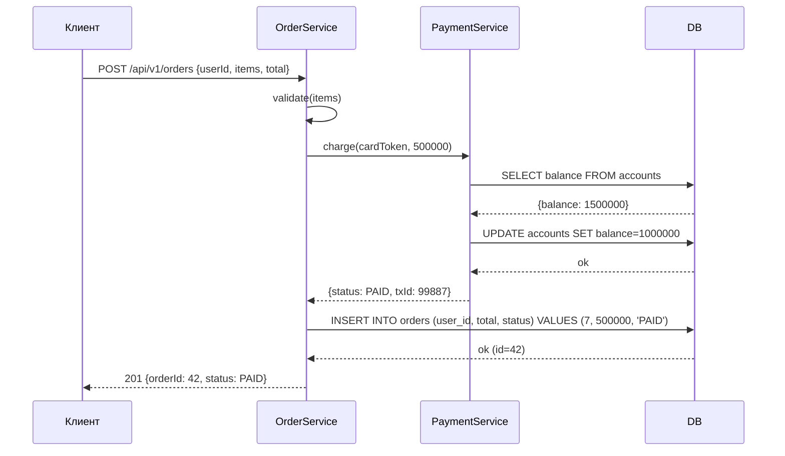
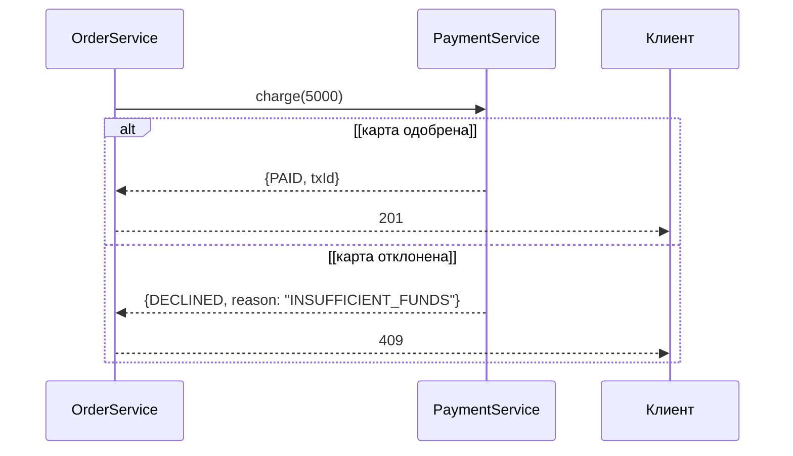
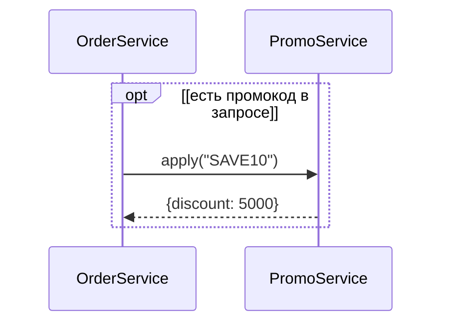
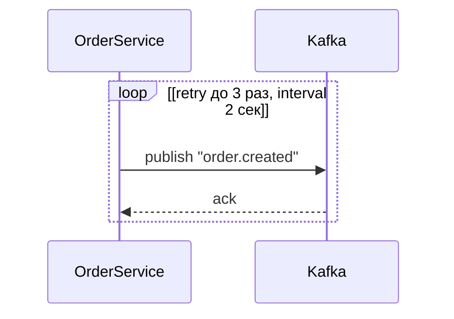
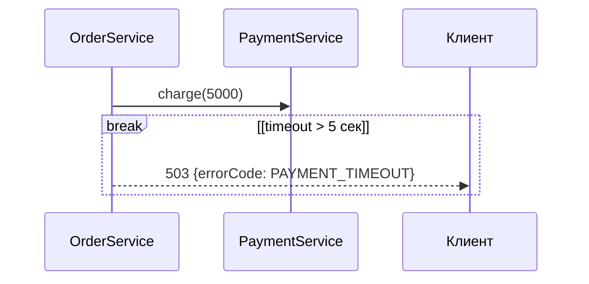
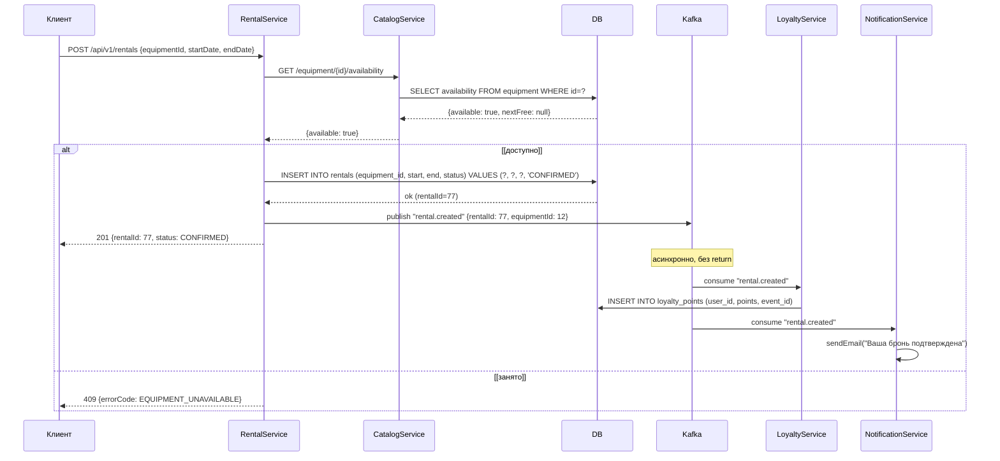
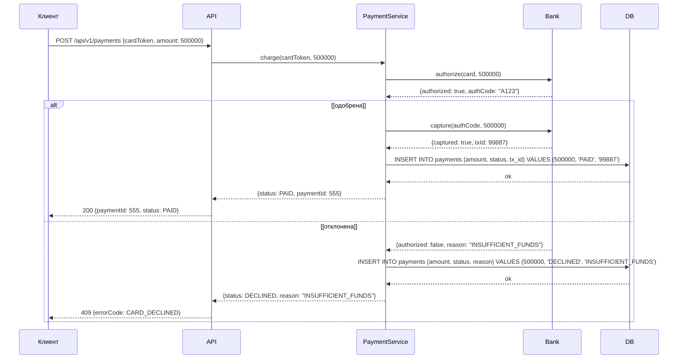
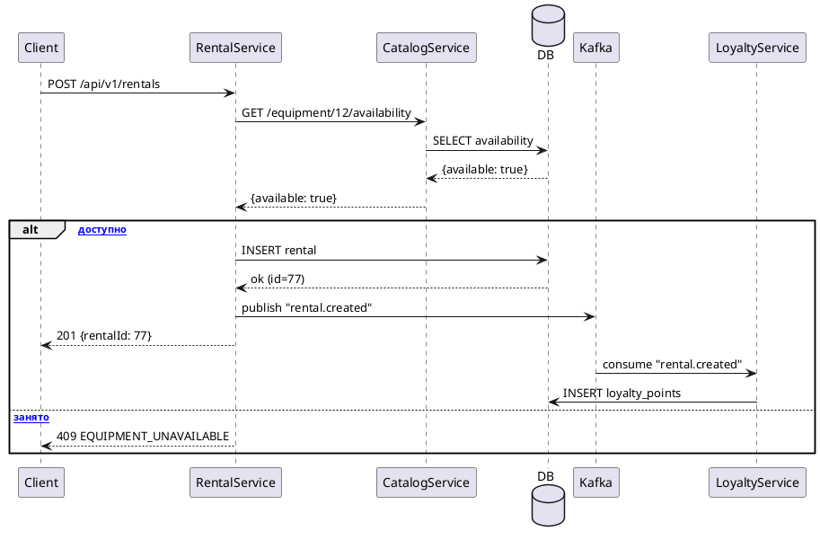
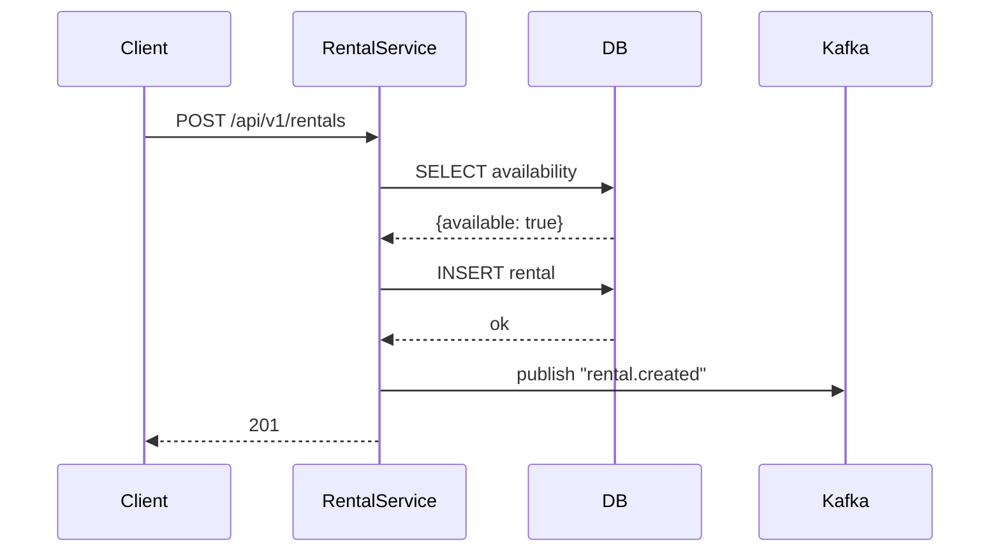

# UML Sequence-диаграммы: вглубь + практика

**Татьяна · подготовка к собесу · 90 минут**

---

## План занятия

1. Зачем sequence и где на собесе
2. Lifeline, sync/async/return, БД как участник
3. Фреймы: alt, opt, loop, break
4. Частые ошибки
5. Практика 1: найти 5 ошибок
6. Практика 2: нарисовать (аренда + оплата)
7. Как рассказывать на собесе
8. Инструменты
9. Домашнее задание

---

## 1. Зачем sequence

**Sequence-диаграмма** — временной сценарий: кто кому, в каком порядке, sync/async, с ветвлениями.

Где:
- ТЗ интеграции: «вот как А общается с Б при создании заказа»
- Собес: «нарисуйте, как работает оплата»
- Разбор инцидента: «вот где таймаут, где retry»

| Диаграмма | Что показывает |
|---|---|
| Use-case | **Что** делает пользователь (функциональность) |
| Activity | **Логика** внутри одного процесса (ветвления) |
| **Sequence** | **Кто кому и в каком порядке** (время по вертикали) |

---

## 2. Основы

### Пример: создание заказа с оплатой



### Элементы

| Элемент | Как выглядит | Значение |
|---|---|---|
| **Lifeline** | Пунктирная вертикаль под участником | Участник (система/сервис/БД) |
| **Sync** `->>` | Сплошная стрелка | Вызов, **жду ответ** |
| **Return** `-->>` | Пунктирная стрелка | **Ответ** на sync |
| **Async** `->>` | Сплошная, **без return** | Событие, не жду (Kafka) |
| **Self-message** | Стрелка от lifeline к себе | Метод внутри объекта |
| **Activation** | Прямоугольник на lifeline | Объект занят в этот момент |

### БД как участник

```
OrderService          DB
  |                     |
  |--- SELECT --------->|
  |<-- {status: NEW} ---|
  |--- UPDATE --------->|
  |<-- ok --------------|
```

БД — **отдельная lifeline**. Не «внутри» сервиса. Показывает, где именно чтение/запись.

### Sync vs Async

```
SYNC:
  OrderService ---> PaymentService: charge(5000)
  OrderService <--  PaymentService: {PAID}     (есть return)

ASYNC:
  OrderService ---> Kafka: publish "order.paid"
  (нет return — не ждём)

  Kafka ---> LoyaltyService: consume "order.paid"   (потом, отдельно)
```

---

## 3. Фреймы

### alt (if/else)



**На каждой ветке — условие.** Не «ветка 1 / ветка 2», а `[одобрена]` / `[отклонена]`.

### opt (может быть)



### loop (повтор / retry)



### break (выход при ошибке)



---

## 4. Частые ошибки

| # | Ошибка | Как правильно |
|---|---|---|
| 1 | Все стрелки sync, нет return | Для каждого `->>` — либо `-->>`, либо async (без return) |
| 2 | Нет БД как участника | БД — отдельная lifeline, SELECT/INSERT явно |
| 3 | `alt` без условий | На каждой ветке: `[условие]` |
| 4 | Kafka выглядит как sync | Kafka: стрелка **без return** |
| 5 | 10+ lifelines | Сгруппировать: «PaymentSystem» вместо 5 сервисов |
| 6 | Нет хронологии | Sequence = время. Сверху вниз — порядок |
| 7 | Неконкретные имена: `process`, `handle` | `chargeCard()`, `checkAvailability()` |

---

## 5. Практика 1: найди 5 ошибок

Дана диаграмма:

```
Клиент          API           Бэкенд
  |               |              |
  |-- POST /pay -->|              |
  |               |-- process ---|
  |               |<-- ok -------|
  |<-- 200 ------|              |
```

**5 ошибок:**

| # | Ошибка | Почему |
|---|---|---|
| 1 | Нет БД | Куда пишется платёж? Где INSERT? |
| 2 | Нет PaymentService | Кто проверяет оплату? `process` — это что? |
| 3 | Нет `alt` | Что если оплата отклонена? Нет ветвления |
| 4 | Нет асинхронной части | После оплаты: баллы, письмо — где? (Kafka) |
| 5 | `process` — неконкретно | Должно быть `chargeCard()` или `verifyPayment()` |

---

## 6. Практика 2: нарисовать

### Кейс А: Аренда оборудования (sync + async)



**Что проверить при рисовании:**
- [ ] 7 lifelines (C, R, Cat, D, K, L, N)
- [ ] БД — отдельная lifeline, 2 SELECT/INSERT
- [ ] `alt` с условиями `[доступно]` / `[занято]`
- [ ] Kafka — стрелка **без return**
- [ ] L и N получают событие **асинхронно** (после ответа клиенту)
- [ ] Порядок: сначала ответ клиенту (201), потом async-обработка

### Кейс Б: Оплата картой (sync, alt)



---

## 7. Как рассказывать на собесе (формула, 60 сек)

1. **«Участники:»**
   «Клиент, RentalService, CatalogService, БД, Kafka, сервис лояльности, сервис уведомлений.»

2. **«Основной поток:»**
   «Клиент шлёт POST /rentals. RentalService запрашивает доступность у CatalogService. CatalogService читает из БД. Если доступно — создаёт бронь в БД, публикует событие в Kafka, отвечает 201.»

3. **«Ветвление:»**
   «Если оборудование занято — alt: возвращаем 409 EQUIPMENT_UNAVAILABLE.»

4. **«Асинхронная часть:»**
   «После 201 клиент уже получил ответ. Асинхронно: Kafka доставляет событие в LoyaltyService (начисляет баллы) и NotificationService (шлёт письмо). Клиент не ждёт.»

5. **«Надёжность:»**
   «Кafka: retry 3 раза. Идемпотентность потребителя: по event_id. Если Kafka недоступна — outbox: событие пишется в БД вместе с заказом, фоновая задача публикует.»

**Вопрос собеса:** «А что если PaymentService упадёт?»
Ответ: «alt: timeout > 5 сек → 503. Бронь не создана, деньги не списаны. Клиент видит "попробуйте позже". В логах — алерт.»

---

## 8. Инструменты

| Инструмент | Плюсы | Минусы |
|---|---|---|
| **draw.io** (app.diagrams.net) | Бесплатно, перетаскивание, UML-фигуры, экспорт PNG/SVG | Не текстовый (нельзя diff в git) |
| **PlantUML** | Текстовый, git-friendly, быстрая генерация | Синтаксис нужно учить |
| **Mermaid** | Встроено в GitHub/Notion, простой синтаксис | Меньше возможностей |
| **Miro / Lucidchart** | В компании | Платно |

### PlantUML (пример)



### Mermaid (пример)



**На собесе:** бумага и ручка (5 мин) или draw.io (если дают экран). Красота не важна — **логика и порядок**.

---

## 9. Частые вопросы собеса

1. Нарисуйте поток оплаты. → alt (одобрена/отклонена), БД, PaymentService
2. Где асинхронность? Как показать? → Kafka, стрелка без return
3. `alt` / `loop` / `opt` / `break` — когда какой?
4. БД — участник или часть сервиса? → Участник, отдельная lifeline
5. Почему return пунктирный? → Ответ, не запрос
6. Как показать, что сервис ждёт? → Sync-стрелка + activation
7. Что если Kafka недоступна? → Outbox pattern (обзорно)

---

## 10. Домашнее задание

1. **Нарисовать** (draw.io или PlantUML) sequence для **аренды** (Кейс А из §6). Сохранить PNG или .puml.

2. **Нарисовать** sequence для **оплаты картой** (Кейс Б из §6). Sync, alt, БД, Bank.

3. **Найти 3 ошибки** в диаграмме (дам на следующем занятии).

4. **Вопросы без ответа** — 3+.

**Сдать:** 2 диаграммы (PNG или .puml) + текст в чат.
