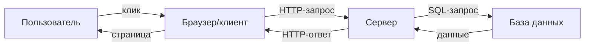
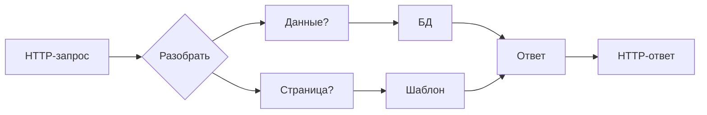
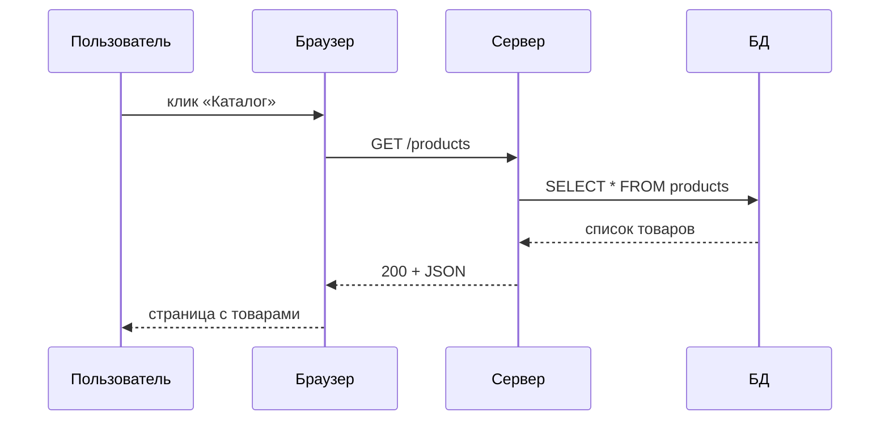

# Урок 1. Из чего состоит приложение

**Модуль 1 · База и «язык аналитика» · 90 минут**

---

## План урока

1. Что такое приложение
2. Клиент-серверная архитектура
3. Браузер
4. Сервер
5. База данных
6. HTTP: запрос и ответ
7. Практика
8. Домашнее задание

---

## Из чего состоит приложение

Сайт, интернет-банк, CRM — всё это **программные системы**

Минимальный набор частей:

- **Клиент** — то, что видит пользователь (браузер или приложение)
- **Сервер** — программа, которая обрабатывает запросы
- **База данных (БД)** — где хранятся данные
- **Сеть** — связывает всё это (HTTP)



---

## Клиент-серверная архитектура

- **Клиент** — активный участник: инициирует запросы
- **Сервер** — пассивный: **ждёт** и отвечает
- Клиентов много, сервер обычно один

Примеры пар «клиент-сервер»:

| Клиент | Сервер |
|---|---|
| Браузер | Веб-сервер |
| Мобильное приложение | API |
| `curl` | Любой HTTP-сервер |

---

## Браузер — это тоже программа

Браузер **не просто открывает файлы** — он:

1. Получает HTML/CSS/JS от сервера
2. Строит страницу (DOM)
3. Отправляет дополнительные запросы (картинки, API)
4. Хранит состояние: cookies, localStorage

Важно для аналитика: браузер — это **клиент**, и его поведение описывается в требованиях.

---

## Сервер

Сервер — программа, которая:

- **Принимает** запросы по HTTP
- **Разбирает** их (что просит клиент?)
- **Обращается** к БД или другим системам
- **Формирует** ответ (HTML, JSON, файл)
- **Отдаёт** его клиенту



---

## База данных

Данные хранятся **не в файлах**, а в СУБД (например, PostgreSQL, MySQL)

- **Таблицы** — как таблицы в Excel
- **Строки** — отдельные записи (например, один клиент)
- **Колонки** — поля (имя, телефон, дата)

```
Таблица users
┌────┬──────────┬──────────────┐
│ id │  name    │   email      │
├────┼──────────┼──────────────┤
│ 1  │ Анна     │ anna@mail.ru │
│ 2  │ Пётр     │ petr@mail.ru │
└────┴──────────┴──────────────┘
```

---

## HTTP — язык общения

**HTTP** (HyperText Transfer Protocol) — протокол передачи данных в вебе

Запрос и ответ — это **просто текст** со структурой

```
Запрос:
GET /products HTTP/1.1
Host: shop.example.ru

Ответ:
HTTP/1.1 200 OK
Content-Type: application/json

[{"name":"Ноутбук","price":120000}]
```

---

## Из чего состоит HTTP-запрос

1. **Метод** — что сделать (GET, POST, PUT, DELETE)
2. **Путь** — к какому ресурсу (/products)
3. **Заголовки** — служебная информация
4. **Тело** — данные (для POST/PUT, не всегда)

```
POST /users HTTP/1.1
Host: shop.example.ru
Content-Type: application/json

{"name": "Иван", "email": "ivan@mail.ru"}
```

---

## Из чего состоит HTTP-ответ

1. **Статус-код** — результат (200, 404, 500...)
2. **Заголовки** — служебная информация
3. **Тело** — содержимое (HTML, JSON, картинка)

| Код | Значение | Пример |
|---|---|---|
| 200 | ОК, всё хорошо | страница найдена |
| 404 | Не найдено | нет такой страницы |
| 500 | Ошибка сервера | сервер упал |

---

## Жизненный цикл одного запроса



---

## Практика 1. Разбор реального сервиса

**Задание.** Откройте интернет-магазин (например, ваш любимый) и определите:

1. Какие «части» приложения вы видите?
2. Когда браузер шлёт запросы серверу?
3. Данные хранятся в БД — приведите 3 примера сущностей (таблиц)

**Формат ответа:** короткая таблица/список. Время — 15 минут.

---

## Практика 2. Репозиторий HTTP

**Задание.** Используя **F12 → Сеть (Network)**:

1. Найдите запрос главной страницы
2. Определите метод, статус, путь
3. Найдите хотя бы один запрос к API/JSON (если есть)

**Формат ответа:** таблица с колонками *метод — путь — статус*.

---

## Ревью и обсуждение

- Сверяем ответы всей группой
- **Ключевые вопросы:**
  - Почему один и тот же сервис «разваливается» на части?
  - Где в этом приложении были бы требования аналитика?
  - Что изменит сервер в ответ, если товар не найден?

---

## Домашнее задание

1. Нарисуйте схему **своего учебного сервиса**: клиент, сервер, БД, сеть
2. Опишите **10 HTTP-запросов**, которые делает пользователь в интернет-магазине (метод + путь + зачем)
3. Назовите 3 сущности-таблицы для интернет-магазина и по 3-4 поля в каждой
4. Вопрос на подумать: чем клиент-серверная архитектура отличается от «одного файла на Excel»?

**Сдать:** текстом в чат или файлом `.md` до следующего урока.