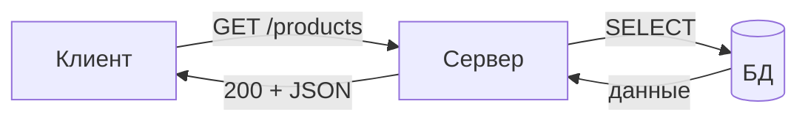
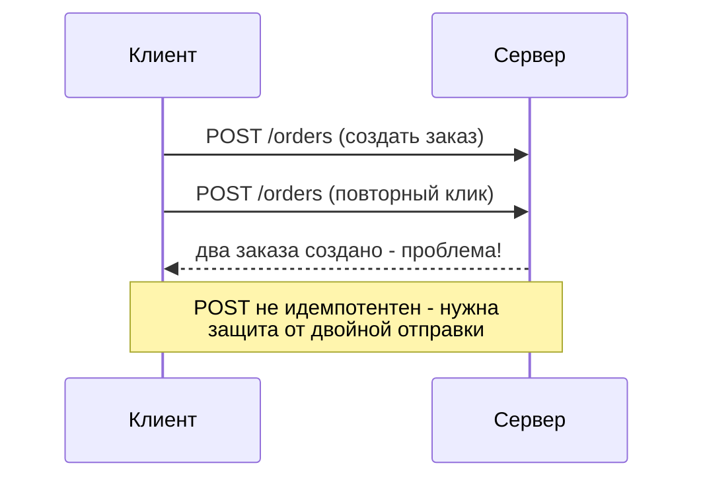
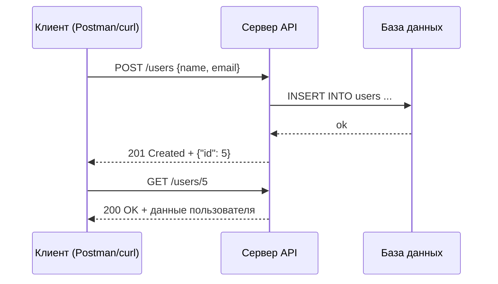

# Урок 2. REST: методы, статусы, JSON/XML

**Модуль 1 · База и «язык аналитика» · 90 минут**

---

## План урока

1. Что такое API и зачем аналитик пишет про него в требованиях
2. REST — архитектурный стиль (не протокол)
3. Ресурсы и URI
4. HTTP-методы: GET, POST, PUT, PATCH, DELETE
5. Идемпотентность — просто
6. Группы статус-кодов: 2xx/3xx/4xx/5xx
7. JSON vs XML
8. Практика: Postman и curl
9. Домашнее задание

---

## API — «интерфейс для программ»

**API** (Application Programming Interface) — правила, по которым **одна программа общается с другой**

Примеры: сайт магазина запрашивает «список товаров», приложение банка — баланс, бухгалтерия тянет отчёт из CRM.

Аналогия: API — это **меню ресторана**. Вы не заходите на кухню, а выбираете блюдо из меню и получаете его готовым.

> Аналитик описывает в требованиях: **какие данные** система получает/отдаёт и **по каким правилам**. Это и есть описание API.

---

## Что такое REST

**REST** (Representational State Transfer) — не протокол, а **архитектурный стиль** (набор идей, как строить API), который работает на обычном HTTP.

Главные идеи «на пальцах»:

- у каждого «объекта» системы есть **адрес (URI)**
- обращаемся к нему **HTTP-методами** (действиями)
- сервер отвечает **статус-кодом** и данными



> «REST не реализует SOAP» — это разные парадигмы. SOAP — строгий протокол на XML, REST — гибкие идеи на HTTP. В современной разработке REST встречается в разы чаще.

---

## Ресурсы и URI

**Ресурс** — «то, о чём говорим»: товар, пользователь, заказ.
**URI** — адрес ресурса: `/сущность/идентификатор`.

| URI | Что значит |
|---|---|
| `/products` | коллекция товаров |
| `/products/42` | конкретный товар с номером 42 |
| `/users/7/orders` | заказы пользователя 7 |

- имена — во множественном числе, по-английски, строчными буквами: `/users`, не `/пользователи`
- `/orders/123` читается понятно; `/page?id=123&f=1` — плохо

> Для аналитика именование URI — **часть требований** к API: плохие имена потом дорого менять.

---

## HTTP-методы — «глаголы» REST

| Метод | Смысл | Когда использовать | Есть тело? |
|---|---|---|---|
| GET | Прочитать | список товаров, страница товара | нет |
| POST | Создать | новый заказ, новый пользователь | да |
| PUT | Полностью заменить | заменить все поля товара | да |
| PATCH | Частично изменить | поменять только цену | да |
| DELETE | Удалить | удалить товар из каталога | обычно нет |

Один ресурс — пять действий:

```
GET    /products   -> список
POST   /products   -> создать
GET    /products/42    -> показать товар 42
PUT    /products/42    -> заменить целиком
PATCH  /products/42    -> изменить цену
DELETE /products/42    -> удалить
```

---

## Идемпотентность — просто

**Идемпотентность** = «сколько ни повторяй — результат тот же».

| Метод | Повтор безопасен? |
|---|---|
| GET | Да — прочитать 100 раз ничего не изменит |
| PUT | Да — заменить на то же самое |
| DELETE | Да — «удалить уже удалённое» безвредно |
| POST | **НЕТ** — каждый POST создаёт новый объект |



В требованиях это звучит как «**защита от повторной отправки формы**».

---

## Статус-коды: четыре группы

Первая цифра — категория:

| Группа | Смысл | «Дословно» |
|---|---|---|
| 2xx | Успех | «Сделано, вот результат» |
| 3xx | Перенаправление | «Иди по другому адресу» |
| 4xx | Ошибка клиента | «Ты что-то не так сделал» |
| 5xx | Ошибка сервера | «У меня проблема» |

Запомнить: 4xx — **вина того, кто спросил**, 5xx — **вина того, кто отвечал**.

---

## Самые нужные статусы

| Код | Название | Когда приходит |
|---|---|---|
| 200 | OK | запрос успешен, данные в ответе |
| 201 | Created | POST создал новый объект |
| 204 | No Content | всё ок, тело пусто (например, после DELETE) |
| 400 | Bad Request | неправильный запрос (битый JSON, нет полей) |
| 401 | Unauthorized | не залогинились — нет токена/пароля |
| 403 | Forbidden | залогинились, но доступа нет |
| 404 | Not Found | ресурс не существует |
| 500 | Internal Server Error | сервер упал / ошибка в коде |
| 502 | Bad Gateway | посредник не достучался до бэкенда |

Примеры: `GET /admin` без прав → **403**; `GET /products/999` → **404**; сервис упал → **500**.

---

## JSON — язык обмена данными

**JSON** — формат текста вида «ключ: значение», главный формат современных REST API.

```json
{
  "id": 42,
  "name": "Ноутбук",
  "price": 120000,
  "inStock": true
}
```

- строки — в **двойных кавычках**, числа и булевы (`true`/`false`) — без кавычек
- легко читается и человеком, и компьютером

---

## XML — старший брат JSON

То же самое, но в виде вложенных тегов:

```xml
<product>
  <id>42</id>
  <name>Ноутбук</name>
  <price>120000</price>
  <inStock>true</inStock>
</product>
```

| JSON | XML |
|---|---|
| короткий, читаемый | многословный |
| современный стандарт REST | чаще legacy/SOAP |
| легче парсится | схемы и валидация «строже» |

---

## Полный цикл REST-запроса



Аналитик «читает» цикл как историю: **кто → каким методом → по какому адресу → что получил в ответ**.

---

## Практика 1. Первый запрос в Postman

Публичный тестовый API: `https://jsonplaceholder.typicode.com/posts`

1. Метод — **GET**, нажмите **Send**
2. Посмотрите: статус, тело ответа (JSON), заголовки

Ответьте: что за данные вернулись? Какая строка статуса? Что будет при методе POST без тела?

**Время — 10 минут.**

---

## Практика 2. Запросы по науке

| Действие | Запрос |
|---|---|
| Прочитать один пост | `GET /posts/1` |
| Создать пост | `POST /posts` + тело JSON |
| Заменить пост | `PUT /posts/1` |
| Удалить пост | `DELETE /posts/1` |
| Комментарии к посту | `GET /posts/1/comments` |

За каждым записывайте **реальный статус-код**.

**Время — 15 минут.**

---

## Практика 3. Тот же путь через curl

В Windows есть встроенный `curl.exe`:

```
curl https://jsonplaceholder.typicode.com/posts/1

curl -X POST https://jsonplaceholder.typicode.com/posts ^
  -H "Content-Type: application/json" ^
  -d "{\"title\":\"тест\",\"body\":\"пример\",\"userId\":1}"

curl -X DELETE https://jsonplaceholder.typicode.com/posts/1
```

`-X` — метод, `-H` — заголовок, `-d` — тело.

**Время — 10 минут.**

---

## Ревью и обсуждение

- Сравниваем статусы, которые получились у всех
- **Ключевые вопросы:**
  - POST и PUT дали разные статусы? Почему?
  - Повторный POST создаст второй пост, а повторный GET? → идемпотентность
  - Что вернёт DELETE по несуществующему посту — 404 или 204?
  - Почему в требованиях пишут «ответ JSON», а не XML?

---

## Домашнее задание

1. Таблица **10 запросов магазина**: метод + URI + ожидаемый статус
2. В Postman или curl выполните **по одному запросу каждого метода** к `jsonplaceholder.typicode.com`, сохраните скриншоты строк статуса
3. По документации GitHub API опишите **3 REST-метода**: метод, URI, что делает, что вернёт
4. Вопрос на подумать: почему для POST используют 201, для GET — 200, а для «создали, но нечего вернуть» — 204?

**Сдать:** текстом в чат или файлом `.md` до следующего урока.