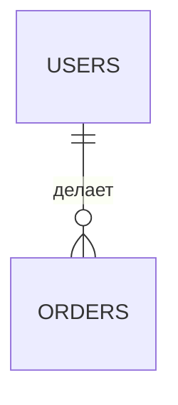
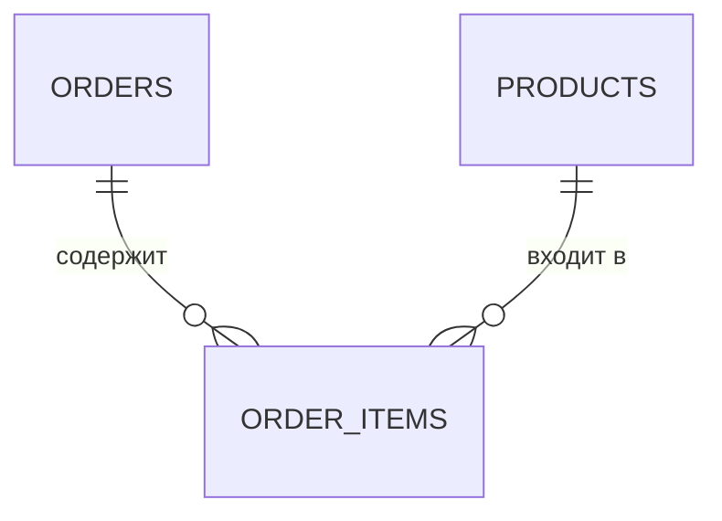
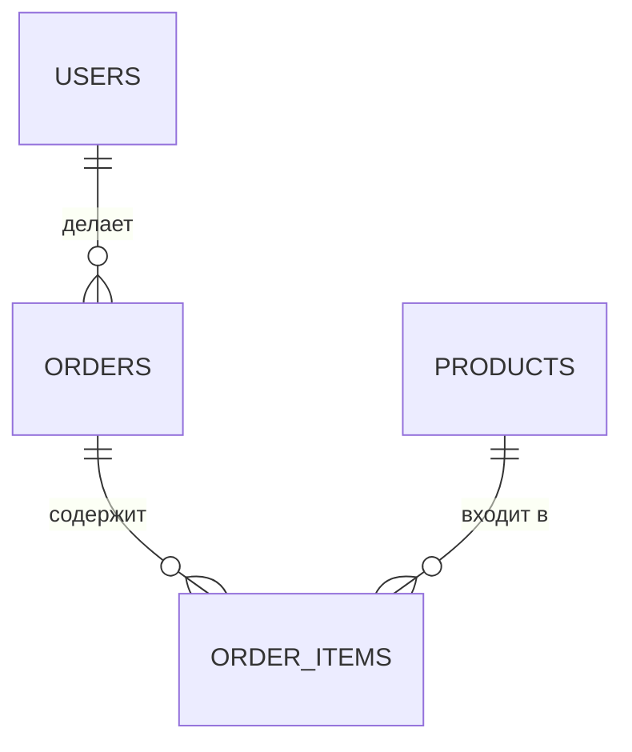

# Урок 3. Реляционная модель: таблицы, ключи, SELECT

**Модуль 1 · База и «язык аналитика» · 90 минут**

---

## План урока

1. Что такое реляционная модель
2. Таблица = отношение, строка = кортеж, колонка = атрибут
3. Первичный ключ (PRIMARY KEY)
4. Внешний ключ (FOREIGN KEY)
5. Связи 1:N и M:N
6. Уникальность и NOT NULL
7. Учебная БД «магазин»
8. Базовый SELECT: колонки, WHERE, ORDER BY, LIMIT
9. Псевдонимы
10. Практика: SELECT-запросы
11. Домашнее задание

---

## Реляционная модель — «таблицы с правилами»

**Реляционная модель** — способ хранить данные в виде **таблиц**, связанных между собой. Почти все СУБД (PostgreSQL, MySQL, Oracle) работают по ней.

Три термина «по-научному» и «по-простому»:

| Термин | По-простому |
|---|---|
| **Отношение** | таблица |
| **Кортеж** | строка (одна запись) |
| **Атрибут** | колонка (одно поле) |

Аналогия: таблица — «анкета», строка — «одна заполненная анкета», колонка — «поле анкеты» (имя, телефон).

---

## Что внутри таблицы

```
Таблица users
┌────┬────────┬──────────────┐
│ id │ name   │ email        │
├────┼────────┼──────────────┤
│ 1  │ Анна   │ anna@mail.ru │
│ 2  │ Пётр   │ petr@mail.ru │
│ 3  │ Ирина  │ irina@mail.ru│
└────┴────────┴──────────────┘
```

- 3 строки = 3 кортежа = 3 пользователя
- 3 колонки = 3 атрибута = 3 поля
- каждая строка описывает **один** объект реального мира
- правило: **строки в таблице не повторяются** — за это отвечает ключ

---

## Первичный ключ (PRIMARY KEY)

**PRIMARY KEY (PK)** — колонка (или набор), которая **уникально** определяет строку.

Свойства PK:

- значение не повторяется
- значение не может быть пустым (NOT NULL)

В магазине первичный ключ — **id**: никогда не повторяется и не меняется.

Почему нельзя просто взять email? Он **может повторяться или меняться**. А id — искусственный неизменный номер.

> Аналитик называет PK «уникальным идентификатором сущности» — это то, по чему система «узнаёт» объект.

---

## Внешний ключ (FOREIGN KEY)

**FOREIGN KEY (FK)** — колонка в одной таблице, которая **ссылается** на PK в другой.

Пример: в таблице `orders` есть колонка `user_id` — она ссылается на `users.id`.

- `user_id = 2` → заказ принадлежит Пётру (`users.id = 2`)
- один пользователь — **несколько** заказов
- FK гарантирует: **нельзя** сослаться на несуществующего пользователя — БД проверит сама

---

## Связь 1:N (один ко многим)

**Один пользователь → много заказов.** Самая частая связь в БД.



- `||` — «один и только один», `o{` — «много» (может быть ноль)
- связь «хранится» на стороне «многих» — в таблице заказов (FK `user_id`)

---

## Связь M:N (многие ко многим)

**Один товар — во многих заказах, один заказ — много товаров.** Прямо так не запишешь: в строке не поместится «список товаров». Нужна **промежуточная таблица** `order_items`.



Строки вида «заказ 1 → товар 5, в количестве 2» — как позиции в чеке. Связь M:N = **две связи 1:N** через промежуточную таблицу.

---

## Уникальность и NOT NULL

Ограничения (constraints) — правила, которые БД держит сама:

| Ограничение | Смысл | Пример |
|---|---|---|
| PRIMARY KEY | уникальность + непустое | `id` |
| UNIQUE | значения не повторяются | `email` |
| NOT NULL | значение обязательно | `name` |
| FOREIGN KEY | ссылка на другую таблицу | `user_id` |

```sql
CREATE TABLE users (
    id    BIGINT PRIMARY KEY,
    email VARCHAR(255) UNIQUE NOT NULL,
    name  VARCHAR(100) NOT NULL
);
```

UNIQUE не даст двух пользователей с одним email; NOT NULL не даст строку без имени.

---

## Учебная БД «Магазин»

Вся схема курса — четыре таблицы:



| Таблица | PK | Специфика |
|---|---|---|
| `users` | `id` | покупатели |
| `products` | `id` | цена, остаток `stock` |
| `orders` | `id` | FK `user_id`, дата, сумма `total` |
| `order_items` | `order_id` + `product_id` | FK на обе таблицы, `quantity` |

---

## SELECT — первый запрос

**SELECT** — «выбери и покажи». Самая частая команда в мире баз данных.

```sql
SELECT name, email
FROM users;
```

- `SELECT` — какие колонки показать
- `FROM` — из какой таблицы
- `SELECT *` — все колонки (удобно, но в коде лучше перечислять явно)

---

## WHERE — фильтр строк

`WHERE` — «покажи только те строки, где условие верно».

```sql
SELECT name, price
FROM products
WHERE price < 100000;
```

Операторы сравнения:

| Оператор | Значение | Пример |
|---|---|---|
| `=` `<>` | равно / не равно | `where name = 'Ноутбук'` |
| `>` `<` `>=` `<=` | больше / меньше | `where price < 100000` |
| `LIKE 'Но%'` | по шаблону | `where name like 'Но%'` |
| `IN (1,2,3)` | одно из значений | `where id in (1,2,3)` |

---

## ORDER BY и LIMIT

`ORDER BY` — отсортировать, `LIMIT` — взять только первые N.

```sql
SELECT name, price
FROM products
ORDER BY price DESC   -- DESC по убыванию, ASC по возрастанию
LIMIT 5;
```

Пять самых дорогих товаров.

```sql
SELECT * FROM orders
WHERE user_id = 2
ORDER BY date DESC
LIMIT 3;
```

Три последних заказа пользователя 2.

---

## Псевдонимы (alias)

`AS` — «дать колонке понятную подпись в результате».

```sql
SELECT
    name AS наименование,
    price AS цена
FROM products;
```

`AS` не меняет таблицу — только подпись в выдаче. Очень помогает в отчётах, которые собирает аналитик.

---

## Практика 1. Разогрев

По учебной БД «магазин» напишите и выполните:

1. Все колонки всех пользователей
2. Только `name` и `price` всех товаров
3. Все товары дороже 50 000
4. Три самых дешёвых товара (`ORDER BY price ASC LIMIT 3`)
5. Все заказы пользователя `user_id = 1`, сортировка по дате

**Время — 10 минут.**

---

## Практика 2. Посложнее

1. Названия товаров со словом «Ноут» (подсказка: `LIKE 'Ноут%'`)
2. Только `email` пользователей с именами Анна или Ирина (подсказка: `IN`)
3. Заказ с самым большим `total` (сортировка + `LIMIT 1`)
4. Запрос с псевдонимами: 3 поля пользователя с русскими подписями

**Формат ответа:** таблица *задание → SQL-запрос → результат*.

**Время — 15 минут.**

---

## Ревью и обсуждение

- Сверяем запросы и результаты
- **Ключевые вопросы:**
  - Зачем нужен PK, если строки и так «вроде разные»?
  - Почему «заказ–товар» не записать без третьей таблицы?
  - Кто «хранит» связь 1:N — пользователь или заказ? Почему?
  - Почему аналитик всегда называет в требованиях «уникальные идентификаторы»?

---

## Домашнее задание

1. Схема для **библиотеки**: читатели, книги, выдачи. Укажите PK, FK и типы связей (1:N, M:N)
2. По БД «магазин» напишите **5 SELECT-запросов с WHERE** и **2 — с ORDER BY + LIMIT**
3. Для требования «выгрузить заказы клиента за последний месяц» напишите сам SQL и объяснение «человеческими словами»
4. Вопрос на подумать: что будет, если в `orders` завести заказ с `user_id`, которого нет в `users`? Пустит ли БД?

**Сдать:** текстом в чат или файлом `.md` до следующего урока.