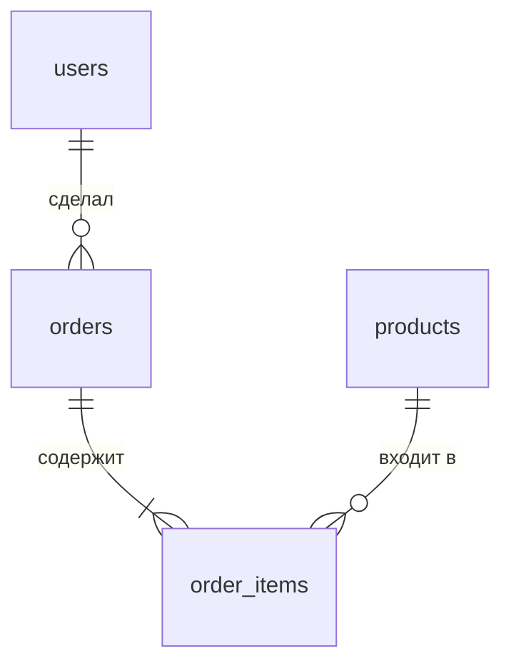

# Урок 4. JOIN: inner, left, right, self

**Модуль 1 · База и «язык аналитика» · 90 минут**

---

## План урока

1. Зачем JOIN
2. Связи между таблицами: внешние ключи
3. INNER JOIN — только совпадения
4. LEFT JOIN — всё из левой + совпадения
5. RIGHT JOIN — зеркальный LEFT
6. SELF JOIN — таблица с собой
7. ON vs WHERE
8. Практика
9. Домашнее задание

---

## Зачем JOIN

Данные живут в **разных таблицах**. Чтобы получить результат в одном запросе, таблицы нужно **соединить**.

Допустим, хотим: «имя покупателя + дата заказа».
- Имя — в таблице `users`
- Дата — в таблице `orders`

Без JOIN — два запроса. С JOIN — один:

```sql
SELECT users.name, orders.order_date
FROM orders
JOIN users ON users.id = orders.user_id;
```

---

## Наша учебная база: связи между таблицами

У каждого заказа есть **внешний ключ** — ссылка на другую таблицу:



Таблица `orders` имеет колонку `user_id` — это **внешний ключ** (FK) на `users.id`.

| Таблица | Внешний ключ | Ссылается на |
|---|---|---|
| orders | user_id | users.id |
| order_items | order_id | orders.id |
| order_items | product_id | products.id |

---

## Учебные данные

**users**

| id | name |
|----|------|
| 1 | Анна |
| 2 | Пётр |
| 3 | Мария |

**products**

| id | name | price |
|----|------|-------|
| 1 | Ноутбук | 89000 |
| 2 | Телефон | 54000 |
| 3 | Наушники | 3500 |
| 4 | Чехол | 500 |

**orders**

| id | user_id | order_date |
|----|---------|------------|
| 1 | 1 | 2025-03-01 |
| 2 | 1 | 2025-03-05 |
| 3 | 2 | 2025-03-10 |

**order_items**

| id | order_id | product_id | qty |
|----|----------|------------|-----|
| 1 | 1 | 1 | 1 |
| 2 | 1 | 3 | 2 |
| 3 | 2 | 2 | 1 |
| 4 | 3 | 4 | 3 |

> Мария (id=3) не делала заказов. Чехол (id=4) заказали.

---

## INNER JOIN — только совпадения

**INNER JOIN** возвращает строки, которые совпадают **с обеих сторон**.

```sql
SELECT users.name, orders.order_date
FROM users
INNER JOIN orders ON users.id = orders.user_id;
```

**Результат:**

| name | order_date |
|------|------------|
| Анна | 2025-03-01 |
| Анна | 2025-03-05 |
| Пётр | 2025-03-10 |

> Мария **отсутствует** — у неё нет заказов. INNER JOIN её не покажет.

---

## LEFT JOIN — всё из левой + совпадения

**LEFT JOIN** возвращает **все** строки из левой таблицы + совпадения из правой. Если совпадений нет — NULL.

```sql
SELECT users.name, orders.order_date
FROM users
LEFT JOIN orders ON users.id = orders.user_id;
```

**Результат:**

| name | order_date |
|------|------------|
| Анна | 2025-03-01 |
| Анна | 2025-03-05 |
| Пётр | 2025-03-10 |
| Мария | NULL |

> Мария теперь видна, но `order_date = NULL` — заказов нет.

**Когда используется:** «Покажи всех клиентов и их заказы» — включая тех, кто ещё ничего не покупал.

---

## RIGHT JOIN — зеркальный LEFT

**RIGHT JOIN** — то же самое, но возвращает **все** строки из **правой** таблицы.

```sql
SELECT users.name, orders.order_date
FROM users
RIGHT JOIN orders ON users.id = orders.user_id;
```

**Результат:** все заказы + совпадения с users. В нашем случае результат совпадает с INNER JOIN, потому что все заказы связаны с пользователями.

> На практике RIGHT JOIN используется **редко** — проще поменять порядок таблиц и использовать LEFT JOIN.

---

## SELF JOIN — таблица с собой

**SELF JOIN** — соединение таблицы **с самой собой**. Полезно, когда данные в одной таблице ссылаются на другие строки той же таблицы.

Пример: у каждого сотрудника есть руководитель.

```sql
CREATE TABLE staff (
    id INT PRIMARY KEY,
    name VARCHAR(50),
    manager_id INT
);
```

| id | name | manager_id |
|----|------|------------|
| 1 | Иван | NULL |
| 2 | Пётр | 1 |
| 3 | Анна | 1 |
| 4 | Мария | 2 |

```sql
SELECT
    e.name AS сотрудник,
    m.name AS руководитель
FROM staff e
LEFT JOIN staff m ON e.manager_id = m.id;
```

**Результат:**

| сотрудник | руководитель |
|-----------|-------------|
| Иван | NULL |
| Пётр | Иван |
| Анна | Иван |
| Мария | Пётр |

---

## ON vs WHERE

- **ON** — условие соединения (какие строки «склеивать»)
- **WHERE** — фильтр **после** соединения

```sql
SELECT users.name, orders.order_date
FROM users
LEFT JOIN orders ON users.id = orders.user_id
WHERE orders.order_date IS NOT NULL;
```

> LEFT JOIN + `WHERE orders.order_date IS NOT NULL` ≈ INNER JOIN.

Разница становится критичной при агрегатах и группировках — обсудим в следующих модулях.

---

## Практика 1. Запросы к магазину

**Задание.** Напишите запросы к учебной БД магазина:

1. Список всех заказов с именами покупателей (LEFT JOIN)
2. Товары, которые **никто не покупал** (LEFT JOIN + NULL)
3. Список товаров в заказе №1 с названиями

---

## Практика 2. Тест на понимание

**Задание.** Определите результат:

```sql
SELECT products.name, order_items.qty
FROM products
LEFT JOIN order_items ON products.id = order_items.product_id
WHERE order_items.qty IS NULL;
```

Какие товары вернёт запрос?

---

## Ревью и обсуждение

- Сверяем ответы всей группой
- **Ключевые вопросы:**
  - Когда использовать LEFT, а когда INNER?
  - Что вернёт RIGHT JOIN если поменять таблицы местами?
  - Зачем нужен SELF JOIN на практике?

---

## Домашнее задание

1. Напишите запрос: покажите всех покупателей и количество их заказов (LEFT JOIN + COUNT)
2. Напишите запрос: товары, которые заказывали больше 1 раза
3. Объясните: почему LEFT JOIN + WHERE по правой таблице может превратиться в INNER JOIN?
4. Придумайте 2 реальных случая для SELF JOIN (не «руководитель»)

**Сдать:** текстом в чат или файлом `.md` до следующего урока.
