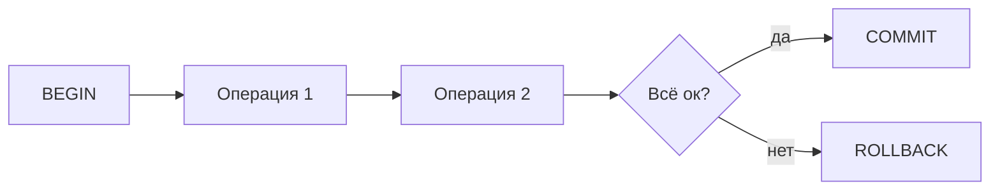

# Урок 5. Индексы, транзакции, нормализация

**Модуль 1 · База и «язык аналитика» · 90 минут**

---

## План урока

1. Индексы: что это и зачем
2. B-дерево простыми словами
3. Когда индекс помогает, а когда мешает
4. UNIQUE-индекс
5. Транзакции: ACID
6. COMMIT и ROLLBACK
7. Нормализация: 1НФ, 2НФ, 3НФ
8. Денормализация как компромисс
9. Практика
10. Домашнее задание

---

## Индексы: что это и зачем

Индекс в БД — как **алфавитный указатель в книге**. Без указателя — листаешь все страницы. С указателем — находишь за секунду.

Без индекса БД **сканирует всю таблицу** (seq scan). С индексом — ищет **быстро** по значению.

```sql
-- Создаём индекс
CREATE INDEX idx_users_email ON users(email);

-- Запрос теперь работает быстро
SELECT * FROM users WHERE email = 'anna@mail.ru';
```

> Индекс создаётся на колонке, по которой **часто ищут**.

---

## B-дерево простыми словами

Индекс обычно строится в виде **B-дерева** (дерева сбалансированности):

- Корень → ветки → листья (данные)
- Поиск: от корня вниз, на каждом уровне отсекая половину данных
- Аналогия: словарь — ищешь слово, открываешь букву, потом страницу

```
        [M]
       /   \
    [F,J]  [S,W]
    / | \   / | \
  [D][G][K][P][T][Z]
```

Для 6 записей — 3 уровня. Для 1000 записей — тоже 3–4 уровня. Скорость не зависит от объёма.

---

## Когда индекс помогает, а когда мешает

| Помогает | Мешает |
|----------|--------|
| WHERE по индекс-колонке | Вставка/обновление каждой строки |
| JOIN по индекс-колонке | Маленькая таблица (нет смысла) |
| ORDER BY по индекс-колонке | Колонка с низкой селективностью |

**Правило аналитика:** если требование — «быстрый поиск по полю X» → индекс по X.

---

## UNIQUE-индекс

**UNIQUE** — индекс, который **запрещает дубликаты**.

```sql
ALTER TABLE users ADD CONSTRAINT uq_users_email UNIQUE (email);
```

Попытка вставить дубликат:
```sql
INSERT INTO users (name, email) VALUES ('Иван', 'anna@mail.ru');
-- ОШИБКА: duplicate key value violates unique constraint
```

> UNIQUE-индекс = «уникальность данных» + «быстрый поиск».

---

## Транзакции: зачем

**Транзакция** — набор операций, которые выполняются **все сразу или ни одна**.

Аналогия: перевод в банке — списание и зачисление должны произойти вместе.

```sql
BEGIN;
UPDATE accounts SET balance = balance - 5000 WHERE id = 1;
UPDATE accounts SET balance = balance + 5000 WHERE id = 2;
COMMIT;
```

> Если вторая операция упала — нужно отменить первую. Это ROLLBACK.

---

## ACID — четыре принципа

| Свойство | Простыми словами |
|----------|-----------------|
| **A** — Атомарность | Всё или ничего |
| **C** — Согласованность | После транзакции данные «корректны» |
| **I** — Изоляция | Параллельные транзакции не мешают друг другу |
| **D** — Долговечность | После COMMIT данные сохраняются |



---

## COMMIT и ROLLBACK

**COMMIT** — «подтвердить, сохранить навсегда».
**ROLLBACK** — «отменить, вернуть как было».

```sql
BEGIN;
UPDATE accounts SET balance = balance - 10000 WHERE id = 1;
-- Ошибка! Баланс стал отрицательным
ROLLBACK;
-- Баланс вернулся к исходному
```

> Без BEGIN/COMMIT каждая команда — отдельная транзакция (auto-commit).

---

## Нормализация: зачем

**Нормализация** — процесс организации данных в таблицы, чтобы:
- Не было дублирования
- Обновление данных не ломало другие данные
- Структура была логичной

---

## 1НФ: нет повторяющихся групп

**До (нарушение 1НФ):**

| user_id | orders |
|---------|--------|
| 1 | З1, З2, З3 |
| 2 | З4 |

**После (1НФ):**

| user_id | order_id |
|---------|----------|
| 1 | 1 |
| 1 | 2 |
| 1 | 3 |
| 2 | 4 |

> В каждой ячейке — **одно значение**.

---

## 2НФ: нет зависимостей от части ключа

**До (нарушение 2НФ):**

| order_id | product_id | product_name | qty |
|----------|------------|-------------|-----|
| 1 | 1 | Ноутбук | 1 |
| 1 | 3 | Наушники | 2 |

`product_name` зависит от `product_id`, **не** от всего ключа (`order_id` + `product_id`).

**После (2НФ):**

Таблица `order_items`: order_id, product_id, qty
Таблица `products`: id, name, price

> Зависимые данные вынесены в отдельную таблицу.

---

## 3НФ: нет транзитивных зависимостей

**До (нарушение 3НФ):**

| user_id | user_name | city_id | city_name |
|---------|-----------|---------|-----------|
| 1 | Анна | 1 | Москва |

`city_name` зависит от `city_id`, не от `user_id`. Это **транзитивная** зависимость: user → city → name.

**После (3НФ):**

Таблица `users`: id, name, city_id
Таблица `cities`: id, name

> Каждая таблица — одна «тема».

---

## Денормализация: компромисс

**Денормализация** — намеренное нарушение нормализации для **производительности**.

Пример: в e-commerce часто хранят `total_price` в заказе, хотя его можно вычислить.

| Когда нормализовать | Когда денормализовать |
|---------------------|----------------------|
| Частые обновления | Частые чтения, редкие обновления |
| Много таблиц OK | «Джойнить» 5 таблиц — дорого |
| Целостность важна | Отчёт должен быть быстрым |

> Для аналитика: понимать, что «красивая» структура ≠ быстрая. Требования определяют баланс.

---

## Практика 1. Индекс и EXPLAIN

**Задание.** В базе магазина:

1. Создайте индекс по `orders.user_id`
2. Запустите `EXPLAIN SELECT * FROM orders WHERE user_id = 1`
3. Сравните с `EXPLAIN` до индекса

---

## Практика 2. Транзакция

**Задание.** Напишите транзакцию:

1. Создайте таблицу `accounts` (id, balance)
2. Вставьте 2 записи (10000, 5000)
3. Переведите 3000 со счёта 1 на счёт 2
4. Проверьте балансы

---

## Ревью и обсуждение

- Сверяем результаты EXPLAIN всей группой
- **Ключевые вопросы:**
  - Индекс ускоряет чтение, но замедляет запись. Когда это критично?
  - Что значит «атомарность» на примере банковского перевода?
  - Как 3НФ помогает при обновлении данных?

---

## Домашнее задание

1. Объясните простым языком: зачем нужен индекс, и приведите 3 примера колонок, по которым стоит индекс создать
2. Напишите транзакцию: перевод 1000 с карты на карту + начисление 5% бонуса получателю
3. Разберите таблицу: приведите её к 3НФ

**Сдать:** текстом в чат или файлом `.md` до следующего урока.
