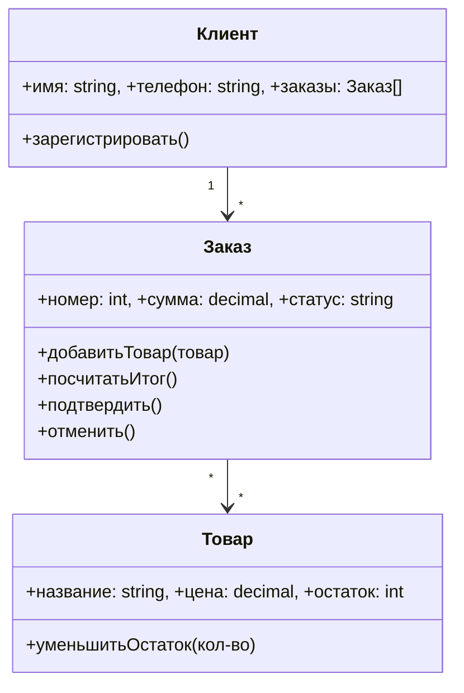
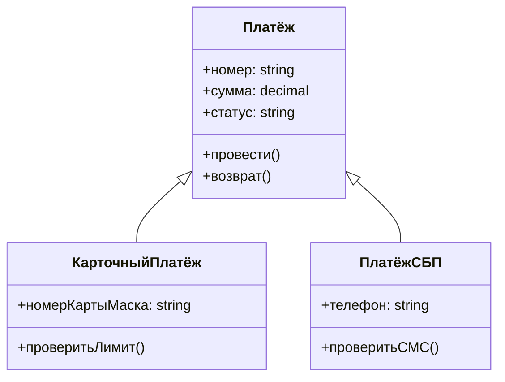

# Урок 6. ООП-основы на практических примерах

**Модуль 1 · База и «язык аналитика» · 90 минут**

---

## План урока

1. Зачем аналитику ООП
2. Класс и объект
3. Атрибуты и методы
4. Инкапсуляция: зачем прятать детали
5. Наследование
6. Полиморфизм
7. Абстракция: выделяем главное
8. Практика
9. Домашнее задание

---

## Зачем аналитику ООП

ООП — не «программистская магия», а **способ организовать описание мира**

Аналитик делает почти то же самое, когда описывает предметную область:

- **Сущности** → классы (Заказ, Клиент, Товар)
- **Конкретные записи** → объекты (Заказ №123, Клиент Анна)
- **Правила** → методы (посчитать сумму, проверить остаток)

Если научиться «думать классами», то модели данных и требования будут собираться сами.

---

## Класс и объект

**Класс** — чертёж/форма/рецепт. Описывает, *из чего состоит* и *что умеет*.

**Объект** — конкретный экземпляр, сделанный по этому чертежу.

| Понятие | Аналогия | Пример |
|---|---|---|
| Класс | Чертёж дома | Класс **Заказ** |
| Объект | Конкретный дом | Объект **Заказ №123** |
| Атрибут | Комната в чертеже | `оплачен`, `сумма` |
| Метод | «подключить электричество» | `подтвердить()` |

Один класс → много объектов: у магазина один класс «Заказ», но тысячи заказов.

```
КЛАСС Заказ
    атрибуты: номер, сумма, статус, клиент, товары[]
    методы: добавитьТовар(), посчитатьИтог(), подтвердить(), отменить()
```

- **Заказ №123** — сумма 4 500 руб., статус «новый», 3 товара
- **Заказ №124** — сумма 1 200 руб., статус «подтверждён», 1 товар

Атрибуты у объектов те же, **значения** — разные.

---

## Класс как схема таблицы

Сильная связь: класс ≈ сущность, объект ≈ строка таблицы.

```
Таблица orders
┌─────┬────────┬──────────────┬─────────┐
│ id  │  sum   │    status    │ client  │
├─────┼────────┼──────────────┼─────────┤
│ 123 │ 4500   │ новый        │ Анна    │
│ 124 │ 1200   │ подтверждён  │ Пётр    │
└─────┴────────┴──────────────┴─────────┘
```

Строка 123 = объект класса «Заказ». Этот мост «класс ↔ таблица» пригодится на всех уроках про данные.

---

## Атрибуты и методы

**Атрибуты** — характеристики (данные).
**Методы** — действия (поведение, правила).

| Сущность | Атрибуты | Методы |
|---|---|---|
| Платёж | номер, сумма, способ, статус | провести(), отменить(), возврат() |
| Клиент | имя, телефон, статус | зарегистрировать(), изменитьАдрес() |
| Товар | название, цена, остаток | уменьшитьОстаток(), скидка() |

Правило жизни: методы **меняют атрибуты**. Метод `подтвердить()` меняет `статус` заказа с «новый» на «подтверждён».

---

## Диаграмма классов



Такую же диаграмму аналитик рисует вместо таблиц, когда объясняет связи сущностей.

---

## Инкапсуляция: зачем прятать детали

**Инкапсуляция** — объект держит данные и правила при себе и не показывает наружу лишнего.

Аналогия: банкомат. Вы нажимаете «снять 1000₽» — и не видите, как он сверяет PIN, связывается с банком, проверяет остаток. **Детали скрыты, наружу — простой интерфейс.**

Смысл: нельзя сломать внутренности объекта со стороны. Внешний мир работает только через разрешённые методы.

---

## Инкапсуляция в псевдокоде

Так делать **нельзя** — поле открыто:

```
КЛАСС Заказ: атрибут статус (открытый)
ЗАКАЗ.статус = "одобрен"    // сторона напортачила напрямую
```

Так — правильно: статус меняется только через метод с проверкой:

```
КЛАСС Заказ: атрибут (скрытый) статус = "новый"

МЕТОД подтвердить()
    ЕСЛИ статус = "новый" ТО статус = "подтверждён"
    ИНАЧЕ ошибка «нельзя подтвердить заказ в статусе ...»
```

Состояние меняется только по правилам. Для аналитика это «**бизнес-правило защищено от случайной порчи**».

---

## Наследование: Платёж и его виды

**Наследование** — новый класс «наследует» всё от родителя и может добавить своё.

- **Родитель (базовый):** Платёж — номер, сумма, статус, методы `провести()`, `возврат()`
- **Наследник 1:** Карточный платёж — + маскированный номер карты, `проверитьЛимит()`
- **Наследник 2:** Платёж по СБП — + номер телефона, `проверитьСМС()`

Общее описание живёт **один раз** (в родителе):



Аналитик так же описывает виды документа: «Платёж» — база, «Платёж по СБП» — частный случай.

---

## Полиморфизм: один интерфейс — много реализаций

**Полиморфизм** — единый способ обращения с разными реализациями.

Псевдокод — работаем с любым видом платежа одинаково:

```
ДЛЯ каждого П платежа в списке:
    П.провести()

КарточныйПлатёж → проверка лимита + списание
ПлатёжСБП      → проверка СМС + перевод
```

Снаружи один вызов `провести()`. Внутри — у каждого вида своя логика. Это удобно:

- обработчик платежей не «разъезжается» по типам;
- новый вид платежа добавится без переделки обработчика.

---

## Абстракция и модель данных

**Абстракция** — оставить важное, отбросить лишнее.

Пример: для описания платёжного функционала важны `номер`, `сумма`, `статус`, `способ`. Не важны: цвет интерфейса, иконка, номер терминала.

| Окно «Платёж» | Важно для модели | Лишнее для модели |
|---|---|---|
| Номер, сумма, статус | ✅ | |
| Способ, дата, клиент | ✅ | |
| Цвет кнопки, шрифт, оформление | | ❌ |

Абстракция — главный инструмент аналитика: иначе требования утонут в деталях. А ещё ООП и модель данных говорят на одном языке:

| ООП | Модель данных | Пример из магазина |
|---|---|---|
| Класс | Сущность / таблица | `orders` |
| Объект | Строка таблицы | заказ №123 |
| Атрибут | Поле / колонка | `sum` |
| Метод | Бизнес-правило | «подтверждать можно только новый заказ» |
| Наследование | Виды сущности | платёж и его подвиды |

Аналитик описывает классы и их связи — разработчик превращает их в код и таблицы.

---

## Практика 1. Классы и объекты магазина

**Задание.** Возьмите интернет-магазин (тот, что разбирали в уроке 1) и сделайте классы:

1. Опишите классы «Пользователь» и «Корзина»: атрибуты + методы (по 3–5)
2. Приведите по 2 объекта для каждого класса с конкретными значениями
3. Покажите связь между классами (кто на кого ссылается)

**Формат ответа:** таблица или простой псевдокод. Время — 15 минут.

---

## Практика 2. Диаграмма «Платёжный сервис»

**Задание.** Дана заготовка: банковское приложение проводит платёж за коммуналку.

1. Нарисуйте классы: Платёж, ПлатёжЗаКоммуналку, Абонент
2. Покажите наследование и связи стрелками
3. Укажите 2 атрибута и 1 метод в каждом классе

**Подсказка:** используйте classDiagram-синтаксис — это уже почти диаграмма сущностей из урока 3.

---

## Ревью и обсуждение

- Сверяем классы и связи всей группой
- **Ключевые вопросы:**
  - Почему «Корзина» и «Заказ» — разные классы? (жизненный цикл разный)
  - Что изменится, если у платёжного сервиса появится платёж «по начислению»?
  - Где в моём банковском приложении спрятана инкапсуляция (что нельзя менять напрямую)?

---

## Домашнее задание

1. Опишите класс «Кредитный договор»: 5 атрибутов, 3 метода, 2 объекта
2. Нарисуйте classDiagram для «Банк → Клиент → Счета/Кредиты» (наследование и связи)
3. Придумайте пример нарушения инкапсуляции (как можно «сломать» класс извне) и как закрыть дыру
4. Вопрос на подумать: чем «класс» отличается от «таблицы» при наследовании видов платежа?

**Сдать:** текстом в чат или файлом `.md` до следующего урока.