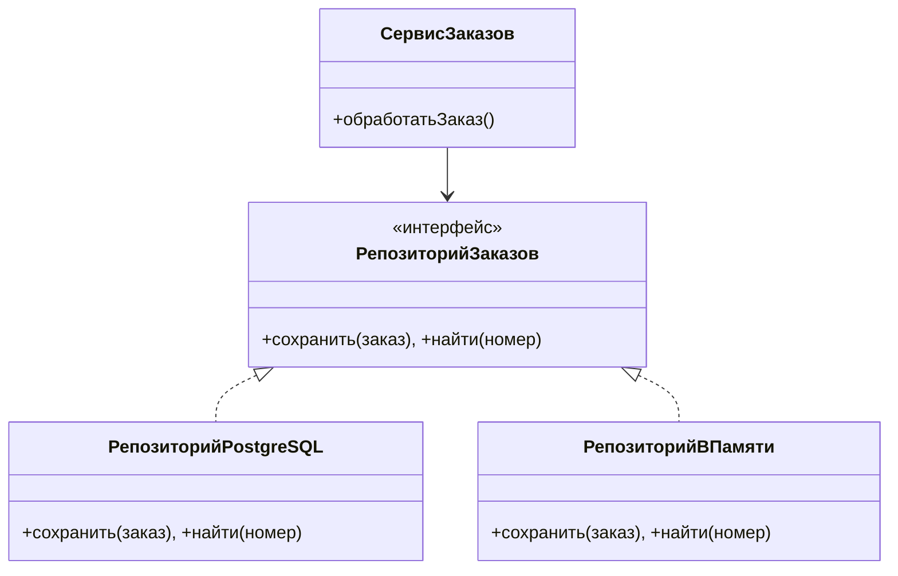
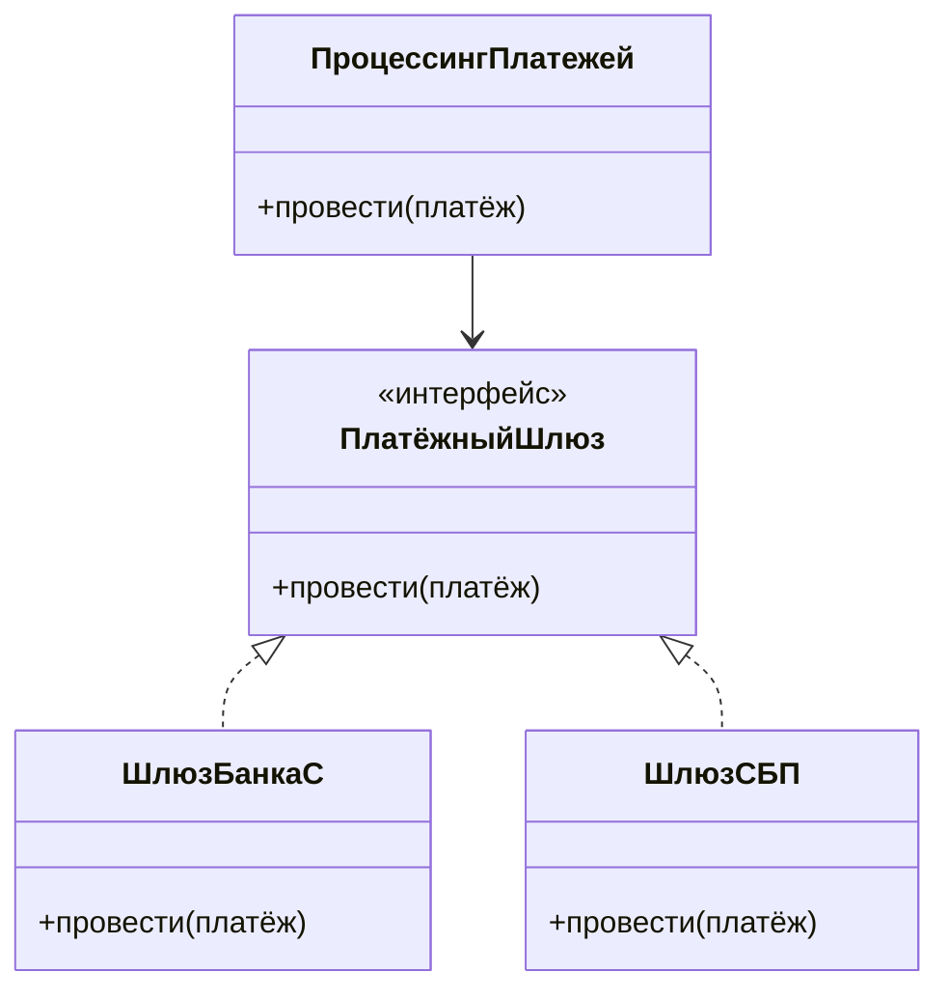

# Урок 7. SOLID на практических примерах

**Модуль 1 · База и «язык аналитика» · 90 минут**

---

## План урока

1. Что такое SOLID и зачем он нужен
2. Обзор пяти принципов
3. S — единственная ответственность
4. O — открытость/закрытость
5. L — подстановка Лисков
6. I — разделение интерфейсов
7. D — инверсия зависимостей
8. SOLID и аналитик
9. Практика
10. Домашнее задание

---

## Что такое SOLID

**SOLID** — аббревиатура из пяти принципов проектирования классов и модулей

| Буква | Принцип | Простым языком |
|---|---|---|
| S | Единственная ответственность | Модуль делает **одно** |
| O | Открытость/закрытость | Расширяем **без изменения** |
| L | Подстановка Лисков | Наследник **ведёт себя как** родитель |
| I | Разделение интерфейсов | Не заставляй делать **лишнее** |
| D | Инверсия зависимостей | Завись от **абстракций**, не от деталей |

**Аналогия «меню ресторана»:**

- **S** — у повара одна работа: готовить. Не он же принимает заказы и моет полы.
- **O** — меню пополняется новыми блюдами, не перепечатывая всю кухню.
- **L** — «мясо» ведёт себя как «еда»: любое блюдо можно съесть.
- **I** — официант не должен уметь жарить, а повар — принимать платежи.
- **D** — кухня работает с «заказом», а не с конкретным посетителем Петей.

Зачем аналитику? Чтобы понимать, **почему система устроена именно так**, и грамотно описывать, как она должна меняться.

---

## S — единственная ответственность

**Нарушение:** один класс делает всё — считает, скидывает, пишет письма, печатает:

```
КЛАСС Заказ: посчитатьСумму(), применитьСкидку(),
             отправитьПисьмоКлиенту(), распечататьЧек()
```

**Исправление:** каждый класс занят своим делом:

```
КЛАСС Заказ    → посчитатьСумму(), применитьСкидку()
КЛАСС Рассылка → отправитьПисьмоКлиенту()
КЛАСС Чек      → распечататьЧек()
```

Почему так: когда меняется «как печатают чек», страдает только Чек, а не расчёт суммы.

---

## O — открытость/закрытость

**Открыт для расширения, закрыт для изменения.**

**Нарушение:** при добавлении нового типа товара приходится править старый код:

```
МЕТОД посчитатьСкидку(товар)
    ЕСЛИ товар.тип = "электроника" ТО скидка 10%
    ЕСЛИ товар.тип = "одежда"      ТО скидка 20%
    // новый тип товара → новая строка if здесь же!
```

**Исправление:** каждый тип сам знает свою скидку:

```
КЛАСС Товар: МЕТОД скидка() → 0%
КЛАСС Электроника НАСЛЕДУЕТ Товар: МЕТОД скидка() → 10%
```

Новый вид товара добавляется отдельным классом, старый код не трогаем.

---

## L — подстановка Лисков

**Наследник должен вести себя так же, как родитель.**

Классическое нарушение — «Квадрат» подменяет «Прямоугольник»:

```
КЛАСС Прямоугольник: ширина, высота; площадь() → ширина × высота

КЛАСС Квадрат НАСЛЕДУЕТ Прямоугольник
    МЕТОД задатьШирину(значение)
        ширина = значение; высота = значение   // сломали поведение родителя!
```

Код, который работает с «Прямоугольником», получает неожиданности от «Квадрата».

**Исправление:** раз они ведут себя по-разному — не один наследник, а отдельные независимые классы.

**Как проверить:** «если код работает с Родителем — тот же код должен работать и с любым наследником». Признаки нарушения:

- наследник выкидывает ошибку там, где родитель работал;
- наследник «тихо» меняет поведение (квадрат меняет высоту);
- наследник требует новых входных данных, которых у родителя не было.

Вопрос аналитика: «Это действительно "тот же платёж" или другой процесс, который лишь назвали платежом?»

---

## I — разделение интерфейсов

**Не заставляй класс реализовывать то, что ему не нужно.**

**Нарушение:** один универсальный «интерфейс кассы» для всех:

```
ИНТЕРФЕЙС Кассир: принятьНаличные(), выдатьСкидку(), принятьКарту()

КЛАСС ОнлайнКасса      // не умеет работать с наличными вручную!
    принятьНаличные() → ошибка «не поддерживается»
```

**Исправление:** интерфейсы помельче, каждый класс берёт только своё:

```
ИНТЕРФЕЙСЫ: ПриёмОпераций → принятьОнлайнПлатёж(); ПриёмНаличных → принятьНаличные(); Скидки → выдатьСкидку()
ОнлайнКасса реализует только ПриёмОпераций и Скидки
```

---

## D — инверсия зависимостей

**Завись от абстракций, а не от конкретных деталей.**

**Нарушение:** сервис заказов жёстко привязан к конкретной базе данных:

```
КЛАСС СервисЗаказов
    БД = Новая РеляционнаяБаза()     // жёсткая зависимость
    обработкаЗаказа(): БД.сохранить(заказ), БД.уведомить
```

Поменяли БД — переписываем сервис. Хуже: тесты без базы не запустишь.

**Исправление:** сервис зависит от «хранилища» — абстракции:

```
ИНТЕРФЕЙС ХранилищеЗаказов: сохранить(заказ), найти(номер)
КЛАСС СервисЗаказов
    хранилище: ХранилищеЗаказов     // что угодно, что умеет хранить
```

---

## SOLID на диаграммах

Инверсия зависимостей: сервис ничего не знает о конкретной базе.



S + O + D вместе: платёжные системы.



S: процессинг только проводит платежи. O: новый шлюз — новый класс. D: процессинг зависит от интерфейса, а не от конкретного банка.

---

## SOLID и аналитик

Принципы — это **язык для описания архитектуры**, на котором аналитик говорит с архитектором:

- «Это требование добавит модуль без изменения существующих» → открытость/закрытость
- «Разными отделами это считается по-разному, но это один тип платежа» → аккуратно с наследованием (L)
- «На момент релиза неизвестно, какая система будет платёжной» → инверсия зависимостей
- «Нам нужен отдельный сервис для расчётов и отдельный для уведомлений» → единая ответственность

Аналитик не выбирает библиотеки, но **понимает, почему архитектура такая** и какие требования её поддержат.

---

## Практика 1. Нарушения в «плохом классе»

**Задание.** Найдите, какие принципы SOLID нарушены в примере:

```
КЛАСС Заказ
    сохранитьВБазу(); посчитатьИтог(); отправитьСМС()
    применитьСкидку(тип)
        ЕСЛИ тип = "курьер" ТО скидка 5%
        ЕСЛИ тип = "самовывоз" ТО скидка 8%

КЛАСС ДропшиппингЗаказ НАСЛЕДУЕТ Заказ
    посчитатьИтог()   // округляет не так, как родитель
    отправитьСМС()    // ставит статус, которого родитель не ставил
```

1. Назовите нарушенный принцип для каждой строчки-проблемы
2. Объясните словами, какие правила «из жизни» тут порушены

Время — 15 минут.

---

## Практика 2. Исправляем один принцип

**Задание.** Возьмите то, что нашёл ваш сосед по паре, и исправьте **один** принцип:

1. Выберите нарушение (S, O, L или D)
2. Напишите, какие классы должны появиться/измениться
3. Нарисуйте короткую classDiagram до и после

**Формат ответа:** 2 диаграммы + 3 фразы «было → стало → почему».

---

## Ревью и обсуждение

- Сверяем списки нарушений всей группой
- **Ключевые вопросы:**
  - Чем «нарушение L» опаснее, чем «нарушение S»? (сложнее найти: падает не сразу)
  - Почему вместе с O обычно приходит D? (чтобы расширение не трогало старое, нужна абстракция)
  - Где в банковском приложении вы бы поставили интерфейс «платёжного шлюза» и зачем?

---

## Домашнее задание

1. Придумайте свой пример нарушения для **каждого** из 5 принципов (по 2–4 строчки псевдокода) и предложите исправление
2. Разберите теорию: «единая ответственность» и «маленький сервис» — это одно и то же? Своё мнение обоснуйте
3. Нарисуйте classDiagram «сервис платежей»: процессинг, интерфейс шлюзов, 2 шлюза (S, O, D одновременно)
4. Вопрос на подумать: почему принцип L называют «принцип подстановки», и как он связан с полиморфизмом из урока 6?

**Сдать:** текстом в чат или файлом `.md` до следующего урока.