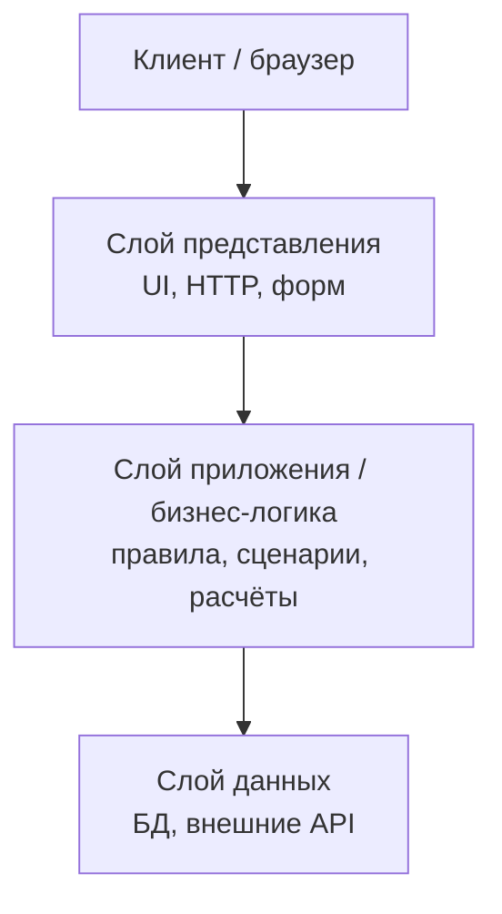
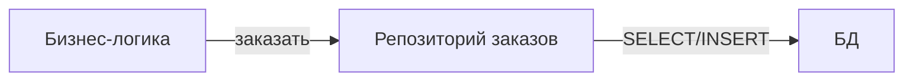
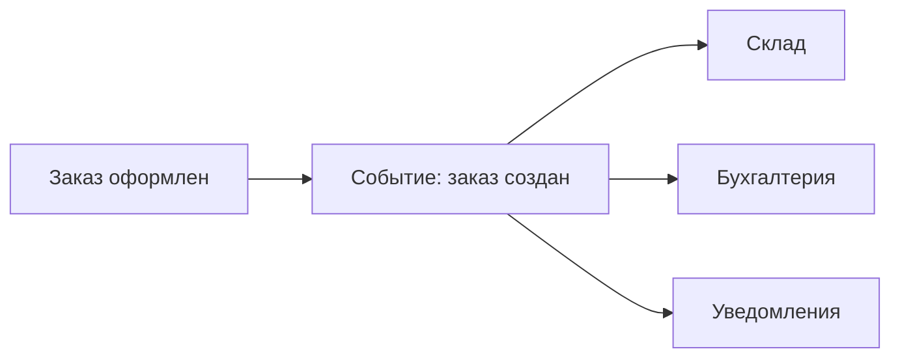
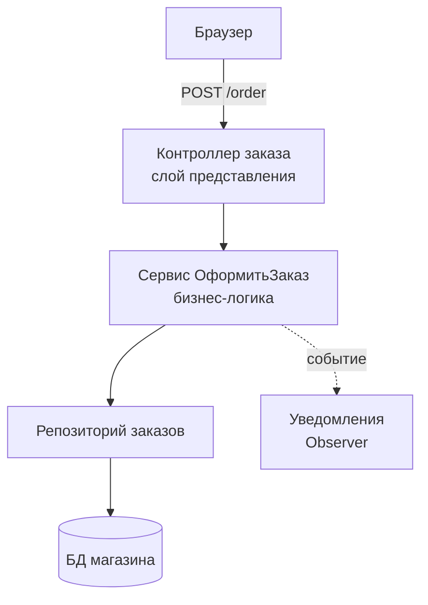

# Урок 8. Слои и базовые паттерны, управление зависимостями

**Модуль 1 · База и «язык аналитика» · 90 минут**

---

## План урока

1. Зачем делить ПО на слои
2. Три классических слоя
3. Правило зависимостей
4. Базовые паттерны: Repository, Service, Factory, Observer
5. Dependency Injection
6. Слои на примере учебного «магазина»
7. Практика
8. Домашнее задание

---

## Зачем делить ПО на слои

Один «кипящий котёл» из всего сразу — это хаос

Слои дают:

- **Порядок** — каждый отвечает за своё
- **Тестируемость** — можно проверить логику без БД
- **Замену деталей** — поменяли БД, а логика не тронута
- **Понятность для команды** — новая логика ложится в своё место

> Аналитик накладывает на слои функциональные требования: «что система делает» живёт в одном слое, «как хранит» — в другом.

---

## Три классических слоя



| Слой | Отвечает за | Примеры |
|---|---|---|
| Представление | Как показать, что ввести | страницы, REST-контроллеры |
| Приложение | Что система делает | проверка правил, расчёты, сценарии |
| Данные | Где и как хранить | SQL, индексы, миграции |

---

## Правило зависимостей

- Верхний слой **не должен знать**, как работает нижний
- Бизнес-логика зависит от **абстракции** («интерфейс хранилища»), а не от конкретной БД

```
Бизнес-логика НЕ говорит: "я знаю, это PostgreSQL"
Бизнес-логика говорит:   "мне нужно хранилище заказов"
```

Благодаря этому:

- можно менять БД, не переписывая логику;
- логику тестируешь с «фальшивым» хранилищем.

---

## Паттерн Repository

**Repository** — посредник между логикой и данными.

Логика не пишет SQL, а просит репозиторий:

```
заказы.найти_by_номер(номер)   → Заказ
заказы.сохранить(заказ)        → ok
```



**Зачем аналитику:** если в требованиях сказано «заказ хранится», репозиторий — место, где это реализуется; аналитик пишет правила, а не SQL.

---

## Паттерн Service (сценарий использования)

**Service / Use-case** — оркестрация: он знает **порядок действий** сценария.

Пример «Оформить заказ»:

1. Проверить корзину
2. Проверить остатки товара
3. Создать заказ через репозиторий
4. Отправить событие «заказ создан»

> То, что аналитик описывает шагами в use-case, Service превращает в код. Поэтому у аналитика и разработчика должны совпадать названия шагов.

---

## Паттерн Factory

**Factory** — фабрика: умеет **создавать** объекты, скрывая детали.

```
оплата = фабрика_оплат.создать(тип: "карта")
оплата = фабрика_оплат.создать(тип: "СБП")
```

Кому нужна фабрика? Когда создание сложное или тип выбирается по условию — не в каждом приложении.

---

## Паттерн Observer (события)

Один **издатель** → много **подписчиков**.

- «Заказ создан» — событие
- Подписчики: бухгалтерия, склад, уведомления — **не вызываются** напрямую



Это мостик к событийному подходу, который будет в уроке 9.

---

## Dependency Injection (DI)

**Внедрение зависимостей** — зависимости **передаются снаружи**, а не создаются внутри.

Плохо:

```
class Отчёт {
    Хранилище = новая БД()   // жёсткая связка
}
```

Хорошо:

```
class Отчёт {
    конструктор(хранилище)   // пришло извне
}
Использование: отчёт = новый Отчёт(передать хранилище)
```

**Плюсы:** легко подменить на «фальшивку» в тестах, меньше связанности.

---

## Слои учебного «магазина» целиком



Пунктиром — событие «заказ создан». Жирные ключевые элементы уже знакомы из предыдущих уроков: HTTP (уроки 1–2), таблицы/БД (уроки 3–5), объекты (урок 6), правила проектирования (урок 7).

---

## Практика 1. Раскрасить слой

**Задание.** Для кейса «Пользователь меняет адрес доставки» определите для каждого шага слой:

1. Браузер показывает форму
2. Сервер проверяет, что адрес заполнен
3. Адрес сохраняется в таблицу
4. Клиенту возвращается «сохранено»

**Формат ответа:** таблица `шаг → слой`. Время — 10 минут.

---

## Практика 2. Найти связи

**Задание.** Возьмите своё учебное приложение (интернет-магазин из урока 2). Предложите:

1. Какие «хранилища» нужны? (2–3 Repository)
2. Какие сценарии — Service? (2–3 use-case)
3. Какие события можно ввести? (2 события)

**Формат ответа:** короткий список. Время — 15 минут.

---

## Ревью и обсуждение

- Сверяем таблицы слоёв всей группой
- **Ключевые вопросы:**
  - Почему «знать» БД внутри логики — плохо?
  - Где закончился бы ваш модуль, если бы его сделали без слоёв?
  - Как слои помогают аналитику при написании ТЗ?

---

## Домашнее задание

1. Нарисуйте **слои** вашего учебного сервиса (3 слоя) и отметьте на них: контроллер, Service, Repository
2. Опишите один **use-case** («Оформить заказ») шагами — рядом отметьте, в каком слое выполняется каждый шаг
3. Придумайте пример, где **DI** помог бы при тестировании
4. Вопрос на подумать: чем паттерн Repository отличается от просто «класса с SQL»?

**Сдать:** текстом или `.md` до следующего урока.