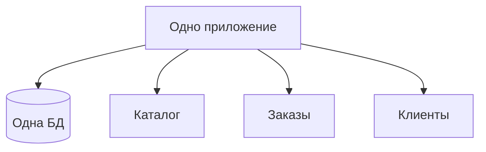
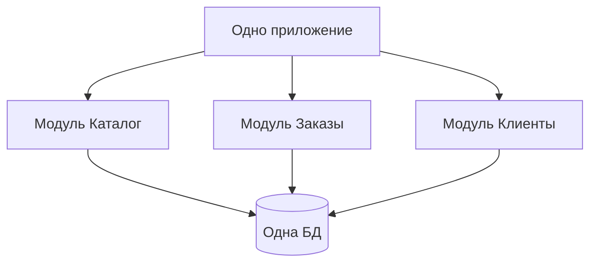
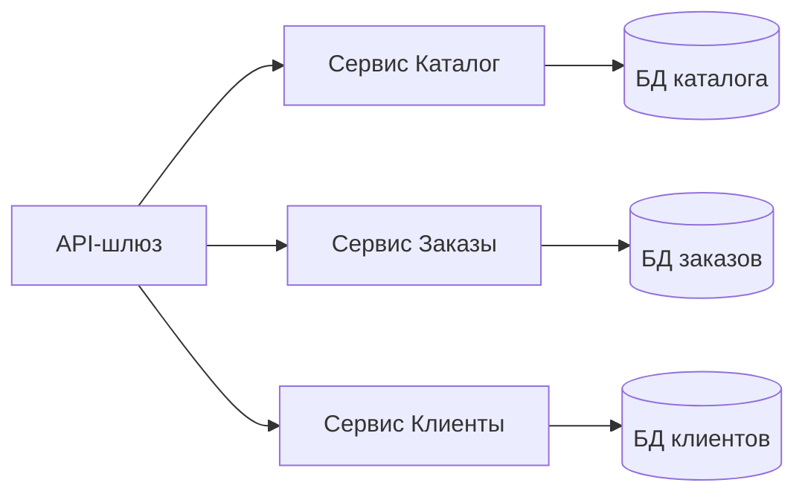
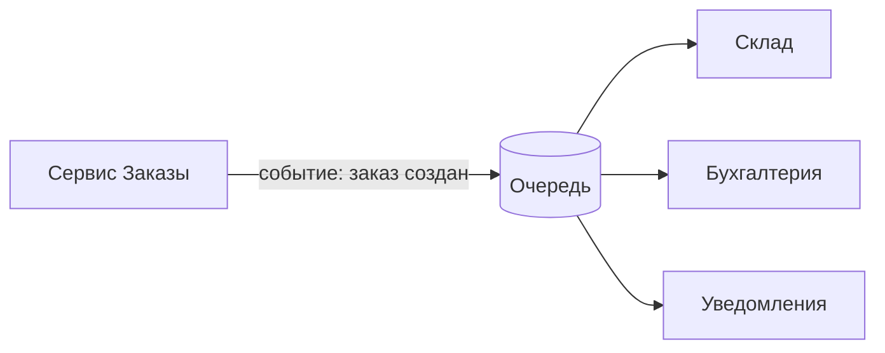

# Урок 9. Архитектурные стили + аттестация модуля

**Модуль 1 · База и «язык аналитика» · 90 минут**

---

## План урока

1. Что такое архитектурный стиль
2. Монолит
3. Модульный монолит
4. Микросервисы
5. Событийный подход
6. Как выбрать стиль
7. **Аттестация модуля 1: демо-задача «разбор учебного сервиса от HTTP до БД»**
8. Домашнее задание

---

## Что такое архитектурный стиль

**Стиль** — способ организовать систему: как части связаны, где границы, как общаются

Это ответ на вопросы:

- Сколько «кусков» и какие?
- Где границы между ними?
- Как части общаются (синхронно/асинхронно)?

> Аналитику стиль нужен, чтобы понимать, о чём говорят архитекторы, и описывать нефункциональные требования (модуль 4).

---

## Монолит

Всё приложение — **одна программа**, один процесс, одна БД

**Плюсы:** простота, быстрое старт, простые транзакции
**Минусы:** один «пункт отказа», сложнее масштабировать и менять части, команды конфликтуют

---

## Модульный монолит

Один процесс, но **чёткие модули** с границами

Модули знают друг о друге **только через публичные интерфейсы**. Близко к «разложенным слоям» из урока 8.

**Почему популярно:** сложность монолита без «адской» распределённости микросервисов.

---

## Микросервисы

Много **отдельных разворачиваемых** сервисов, у каждого своя БД

**Плюсы:** независимое масштабирование, команды не конфликтуют, разные технологии.
**Минусы:** распределённость — сеть, согласованность, сложные транзакции, операции.

---

## Событийный подход

Сервисы общаются через **события** и очереди, а не прямые вызовы

- Издатель **не ждёт** ответа подписчиков
- Каждый подписчик обрабатывает по-своему
- Часто комбинируется с микросервисами

**Пример:** «заказ создан» → склад резервирует, бухгалтерия списывает, клиенту шлётся письмо.

---

## Как выбрать стиль

Вопрос «какой стиль лучше?» неправильный. Правильный: **что важнее для конкретной системы**:

| Хотим | Тянем к |
|---|---|
| Быстро и просто | монолит |
| Контроль границ без сложностей | модульный монолит |
| Независимое масштабирование | микросервисы |
| Асинхронность, надёжность обработки | событийный подход |

Стили **сочетаются**: микросервисы + события внутри = частая рабочая связка.

---

## Аттестация модуля 1

**Демо-задача:** разобрать учебный сервис **от HTTP до БД**

Что нужно сделать (письменно, ваш формат):

1. Назвать все части системы от браузера до БД
2. Для каждой части — роль и границы (какой слой)
3. Показать путь одного запроса (HTTP → слой логики → БД → ответ)
4. Выбрать архитектурный стиль и **обосновать**
5. Описать 2–3 сущности БД и их связь

Время на подготовку — **20 минут**, потом защита.

---

## Практика (подготовка к аттестации)

За 20 минут соберите ответ по вашему учебному сервису:

- Рисунок/схема: браузер → HTTP → сервер → слой логики → данные
- Список частей с ответственностью
- Выбор стиля + 2 аргумента
- 2–3 таблицы с ключами и связью

**Формат:** короткий документ или схема — как удобно.

---

## Ревью и обсуждение

Защита (для каждого):

- 5–7 минут — презентация решения
- Вопросы учителя: «почему выбрали стиль?», «что будет, если пользователей станет 1000?», «где здесь аналитик пишет требования?»

**Критерии оценки** — на следующем слайде.

---

## Критерии аттестации

| Критерий | Признак выполнения |
|---|---|
| Полнота картины | Названы все части: клиент, HTTP, сервер, логика, БД |
| Роли частей | Каждая часть с ответственностью и слоем |
| Путь запроса | Корректная последовательность шагов запроса |
| Стиль | Выбран стиль и дано ≥2 аргументов |
| Данные | 2–3 сущности с ключами и связью |
| Защита | Ответы на вопросы без «это не моё» |

---

## Домашнее задание

1. Письменно оформить разбор своего учебного сервиса **по шаблону аттестации** (если не сдано как выполненная аттестация)
2. Прочитать одну статью про монолит vs микросервисы — принести 3 аргумента «за» и «против» каждого
3. Вопрос на подумать: какие части вашего сервиса **критичны к транзакциям** (банковский пример — из урока 5)?

**Сдача:** до следующей недели; модуль 1 считается пройденным при выполнении критериев аттестации.