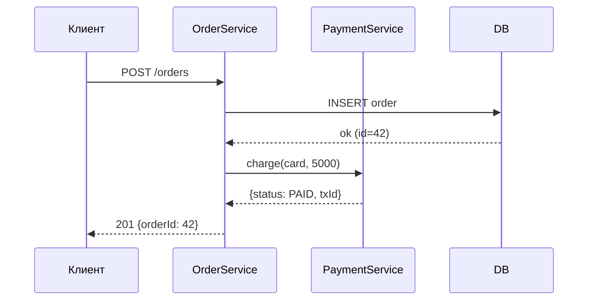
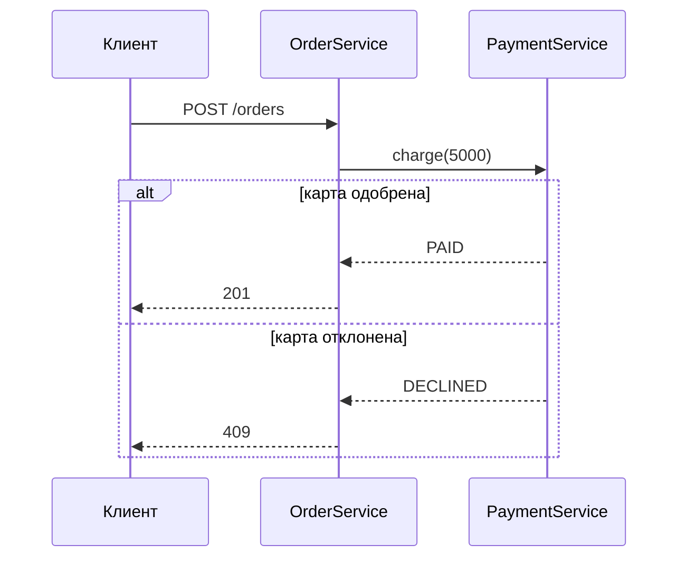
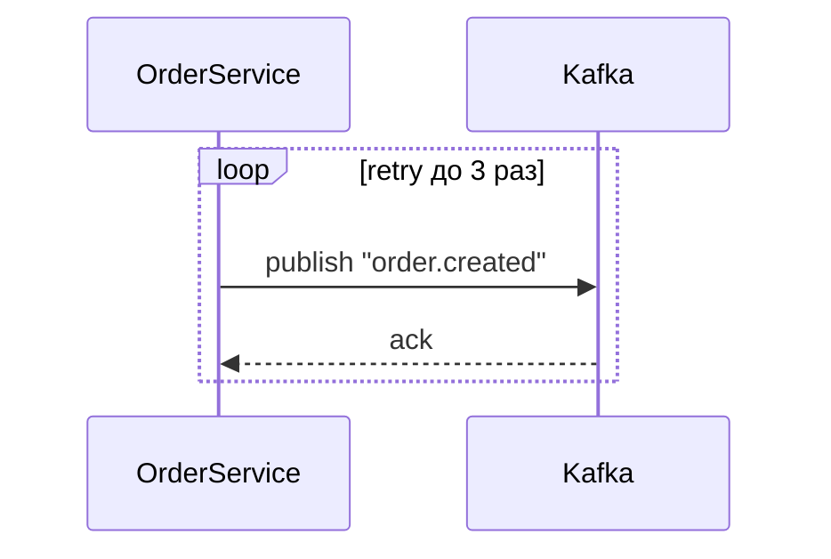
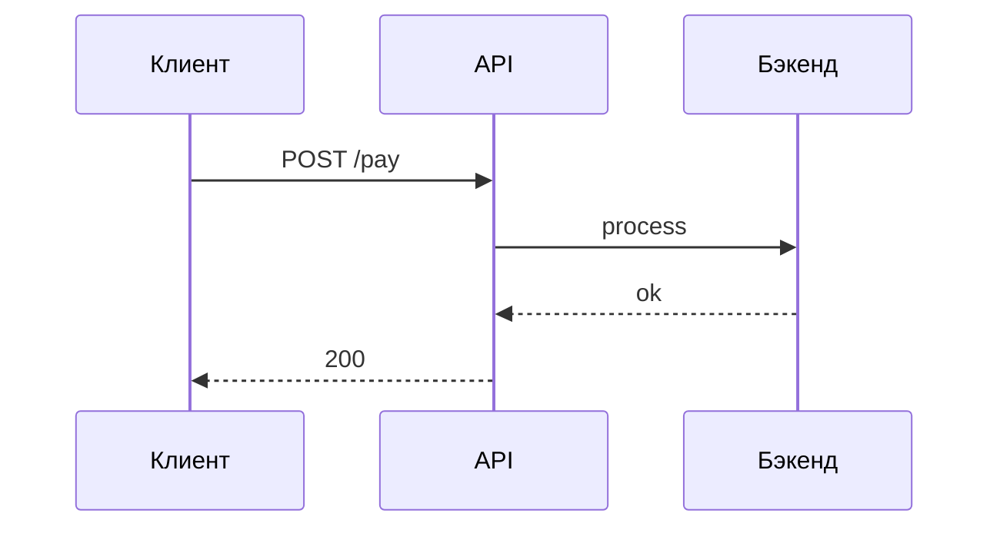

# UML Sequence-диаграммы: вглубь + практика на интеграционном кейсе

**Татьяна · подготовка к собесу · 90 минут**

> «Sequence — часто спрашивают» (из плана). Формат: лекция в диалоге + практика нарисовать.

---

## План занятия

1. Зачем sequence и где она на собесе
2. Акторы, lifeline, сообщения: синхронное/асинхронное
3. Фреймы: alt, loop, opt, break — когда какой
4. БД как участник, self-message, активация
5. Частые ошибки на diagramмах
6. Практика 1: прочитать и найти ошибки в готовой диаграмме
7. Практика 2: нарисовать интеграционный сценарий (аренда + лояльность)
8. Как говорить о диаграмме на собесе (речь)
9. Домашнее задание

---

## 1. Зачем sequence и где на собесе

**Sequence-диаграмма** — это **временной** сценарий взаимодействия объектов/систем: кто кому, в каком порядке, синхронно/асинхронно, с ответами и ветвлениями.

Где встречается:
- **ТЗ интеграции:** «вот как система А общается с Б при создании заказа»
- **Собес:** «нарисуйте, как будет работать оплата» / «покажите на диаграмме»
- **Разбор инцидента:** «вот где таймаут, где retry»

**Чем отличается от activity и use-case:**
- use-case — **что** делает пользователь (сценарий на уровне функциональности)
- activity — **логика** внутри одного процесса (ветвления, параллельность)
- **sequence — кто кому и в каком порядке** (время по вертикали)

**Вопрос:** чем sequence отличается от flowchart? (flowchart — логика одного процесса, sequence — взаимодействие нескольких участников во времени)

---

## 2. Основы: lifeline, сообщения

### Акторы (участники)
Верхняя строка: прямоугольники с именами систем/объектов.
- `Client` (пользователь/приложение)
- `OrderService`
- `PaymentService`
- `DB` (база данных)
- `Kafka` (шина событий)

Под каждым — **lifeline** (пунктирная вертикаль). Всё, что происходит — на этой линии.

### Сообщения
Стрелки между lifelines:

| Вид | Значение |
|---|---|
| `->>` (сплошная, стрелка) | **Синхронный** вызов: жду ответ |
| `-->>` (пунктирная) | **Ответ** (return) |
| `->>` (сплошная, без ожидания) | **Асинхронное** сообщение/событие: положил и поехал |
| `self-message` | вызов самому себе (метод внутри объекта) |



**Вопрос:** какая стрелка синхронная, а какая ответ? Почему return — пунктирная?

---

## 3. Фреймы (опциональные блоки)

Фрейм — прямоугольник вокруг части диаграммы с надписью. Означает: «внутри — ветвление/повтор/условие».

| Фрейм | Смысл | Пример |
|---|---|---|
| `alt` | if/else (ветвление) | «карта одобрена / карта отклонена» |
| `opt` | может быть / может не быть | «если есть промокод — применить» |
| `loop` | повтор | «retry до 3 раз» |
| `break` | выход из последовательности (ошибка) | «если timeout — бросить» |





**Вопрос:** какой фрейм для «может быть промокод»? А для «retry 3 раза»?

---

## 4. Актёр-БД, self-message, активация

### БД как участник
БД — это **участник** (lifeline), не «внутри» сервиса. Показывает, где именно происходит чтение/запись.

```
O->>D: SELECT * FROM orders WHERE id=42
D-->>O: {status: NEW}
O->>D: UPDATE orders SET status=PAID WHERE id=42
D-->>O: ok
```

### Self-message
Вызов метода внутри одного объекта:

```
O->>O: validate(items)
O->>O: checkStock()
```

### Активация (activation box)
Прямоугольник на lifeline — «объект в этот момент работает». Помогает видеть, кто занят.

---

## 5. Частые ошибки

| Ошибка | Как правильно |
|---|---|
| Все стрелки синхронные, нет return | Для каждого `->>` без ответа — либо асинхронное, либо `-->>` return |
| Нет БД как участника, «сервер просто отвечает» | БД — отдельная lifeline, показываются SELECT/INSERT |
| Фрейм `alt` без условий на стрелках | На каждой ветке `alt` — условие: `[карта одобрена]`, `[карта отклонена]` |
| Асинхронное событие выглядит как синхронный вызов | Событие в Kafka — `->>` без return (или пунктир + подписка) |
| Слишком много участников (10+ lifelines) | Сгруппировать: «PaymentSystem» вместо 5 микросервисов |
| Нет времени/порядка | Sequence — это **время**, порядок сверху вниз обязателен |

**Вопрос:** что не так с диаграммой, где `Client ->> Server: POST /orders` и сразу `Server ->> Client: 201`, но нет БД и нет проверки оплаты?

---

## 6. Практика 1: найди ошибки (10 мин)

Дана диаграмма (на экране / в mermaid):



**Ошибки (она находит, я подталкиваю):**
1. Нет БД как участника (где пишется платёж?)
2. Нет проверки оплаты (вызов платёжного сервиса?)
3. Нет ошибок (что если платёж отклонён? — нужен `alt`)
4. Нет асинхронного уведомления (например, письмо/баллы — Kafka)
5. `process` — неопределённое действие, нужно конкретное: `chargeCard()`

---

## 7. Практика 2: нарисовать сценарий (20 мин)

**Кейс:** пользователь бронирует оборудование (аренда, из ДЗ ч.2).

**Сценарий (она рисует, я направляю):**
1. Клиент → `RentalService`: `POST /api/v1/rentals`
2. `RentalService` → `CatalogService`: `GET /equipment/{id}/availability`
3. `CatalogService` → `DB`: `SELECT availability`
4. `DB` → `CatalogService`: данные
5. `CatalogService` → `RentalService`: `{available: true}`
6. **alt** [доступно / занято]
   - занято → `RentalService` → `Client`: `409`
   - доступно → продолжаем
7. `RentalService` → `DB`: `INSERT rental`
8. `DB` → `RentalService`: ok
9. `RentalService` → `Kafka`: publish `rental.created` (асинхронно, без return)
10. `RentalService` → `Client`: `201 {rentalId}`
11. **асинхронно** (внизу, другой «поток»):
    - `Kafka` → `LoyaltyService`: consume `rental.created`
    - `LoyaltyService` → `DB`: `UPDATE loyalty` (баллы)
    - `Kafka` → `NotificationService`: consume `rental.created`
    - `NotificationService` → `EmailService`: отправить письмо

**Вопросы во время рисования:**
- Где БД? (два раза: каталог + бронь)
- Где асинхронное? (Kafka → лояльность, уведомление)
- Где `alt`? (доступно/занято)
- Почему Kafka-событие без return? (асинхронное, не ждём)

---

## 8. Как говорить о диаграмме на собесе

Формула рассказа (30–60 сек):
1. **«Участники:»** — кто на диаграмме (1–2 фразы на каждого).
2. **«Основной поток:»** — по порядку, «клиент шлёт → сервис проверяет → пишет в БД → отвечает».
3. **«Ветвление:»** — «если занято — 409, если нет — создаём».
4. **«Асинхронная часть:»** — «после создания публикуем событие в Kafka, лояльность и уведомления обрабатывают отдельно, клиент уже получил ответ».
5. **«Где ошибки/надёжность:»** — «retry на Kafka, идемпотентность потребителя по rentalId».

**Вопрос собеса:** «А что будет, если PaymentService упадёт?» — ответ по диаграмме: «alt: если timeout → 503, заказ не создан, деньги не списаны».

---

## 9. Частые вопросы собеса по sequence

1. Нарисуйте поток оплаты картой. (alt: одобрена/отклонена, БД, платёжный сервис)
2. Где на диаграмме асинхронность? Как показать? (Kafka, стрелка без return)
3. Что такое `alt`/`loop`/`opt`? Когда какой?
4. БД — участник или часть сервиса? (участник, отдельная lifeline)
5. Почему return — пунктирная стрелка? (ответ, не новый запрос)
6. Как показать, что сервис ждёт ответ? (активация, sync-стрелка)
7. Что будет, если Kafka недоступна при публикации? (outbox pattern — обзорно)

---

## 10. Инструменты

- **draw.io** (diagrams.net) — бесплатно, онлайн, UML-фигуры.
- **PlantUML** — текстовый формат, генерация картинки.
- **Mermaid** (в этом документе) — встроено в GitHub/Notion.
- **Lucidchart / Miro** — платно, но есть в компаниях.

На собесе обычно: **бумага/доска** (нарисовать за 5 минут) или **draw.io** (если дают экран).

---

## Домашнее задание

1. **Нарисовать** (в draw.io или PlantUML) sequence для **кейса из ДЗ ч.2** (`POST /api/v1/rentals` + асинхронные события). Сохранить картинку + текст (если PlantUML).
2. **Нарисовать** sequence для **оплаты картой** (sync): клиент → API → PaymentService → Банк → ответ. С `alt` (одобрена/отклонена) и БД.
3. **Найти 3 ошибки** в диаграмме (приложу на следующем занятии, или взять из практики 1).
4. **Вопросы без ответа** — список.

**Сдать:** 2 диаграммы (картинка или .puml) + текст в чат.

---

## Резюме занятия (проговори в конце)

- Sequence = время + участники + сообщения. Вертикаль — время.
- Lifeline для каждого участника (включая БД!).
- Sync (`->>`), return (`-->>`), async (без return).
- Фреймы: `alt` (ветвление), `opt` (может быть), `loop` (повтор), `break` (выход).
- Ошибки: нет БД, нет return, sync там где async, слишком много участников.
- На собесе: рассказать за 60 сек по формуле (участники → поток → ветвление → async → ошибки).
